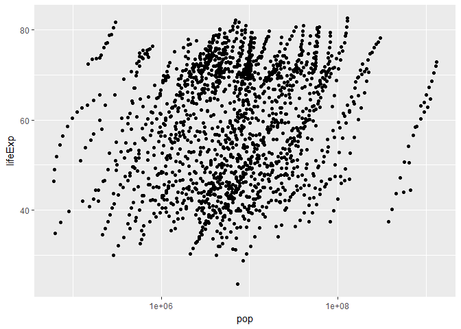

hw01\_gapminder
================
yanchao

Load packages"gapminder"
------------------------

``` r
library(gapminder)
##First time should install "gapminder" using R code: Install.pakages("gapminder")
```

Display the structure of "gapminder"
------------------------------------

``` r
str(gapminder)
```

    ## Classes 'tbl_df', 'tbl' and 'data.frame':    1704 obs. of  6 variables:
    ##  $ country  : Factor w/ 142 levels "Afghanistan",..: 1 1 1 1 1 1 1 1 1 1 ...
    ##  $ continent: Factor w/ 5 levels "Africa","Americas",..: 3 3 3 3 3 3 3 3 3 3 ...
    ##  $ year     : int  1952 1957 1962 1967 1972 1977 1982 1987 1992 1997 ...
    ##  $ lifeExp  : num  28.8 30.3 32 34 36.1 ...
    ##  $ pop      : int  8425333 9240934 10267083 11537966 13079460 14880372 12881816 13867957 16317921 22227415 ...
    ##  $ gdpPercap: num  779 821 853 836 740 ...

Print gapminder to screen
-------------------------

``` r
class(gapminder)
```

    ## [1] "tbl_df"     "tbl"        "data.frame"

``` r
gapminder
```

    ##                       country continent year  lifeExp        pop
    ## 1                 Afghanistan      Asia 1952 28.80100    8425333
    ## 2                 Afghanistan      Asia 1957 30.33200    9240934
    ## 3                 Afghanistan      Asia 1962 31.99700   10267083
    ## 4                 Afghanistan      Asia 1967 34.02000   11537966
    ## 5                 Afghanistan      Asia 1972 36.08800   13079460
    ## 6                 Afghanistan      Asia 1977 38.43800   14880372
    ## 7                 Afghanistan      Asia 1982 39.85400   12881816
    ## 8                 Afghanistan      Asia 1987 40.82200   13867957
    ## 9                 Afghanistan      Asia 1992 41.67400   16317921
    ## 10                Afghanistan      Asia 1997 41.76300   22227415
    ## 11                Afghanistan      Asia 2002 42.12900   25268405
    ## 12                Afghanistan      Asia 2007 43.82800   31889923
    ## 13                    Albania    Europe 1952 55.23000    1282697
    ## 14                    Albania    Europe 1957 59.28000    1476505
    ## 15                    Albania    Europe 1962 64.82000    1728137
    ## 16                    Albania    Europe 1967 66.22000    1984060
    ## 17                    Albania    Europe 1972 67.69000    2263554
    ## 18                    Albania    Europe 1977 68.93000    2509048
    ## 19                    Albania    Europe 1982 70.42000    2780097
    ## 20                    Albania    Europe 1987 72.00000    3075321
    ## 21                    Albania    Europe 1992 71.58100    3326498
    ## 22                    Albania    Europe 1997 72.95000    3428038
    ## 23                    Albania    Europe 2002 75.65100    3508512
    ## 24                    Albania    Europe 2007 76.42300    3600523
    ## 25                    Algeria    Africa 1952 43.07700    9279525
    ## 26                    Algeria    Africa 1957 45.68500   10270856
    ## 27                    Algeria    Africa 1962 48.30300   11000948
    ## 28                    Algeria    Africa 1967 51.40700   12760499
    ## 29                    Algeria    Africa 1972 54.51800   14760787
    ## 30                    Algeria    Africa 1977 58.01400   17152804
    ## 31                    Algeria    Africa 1982 61.36800   20033753
    ## 32                    Algeria    Africa 1987 65.79900   23254956
    ## 33                    Algeria    Africa 1992 67.74400   26298373
    ## 34                    Algeria    Africa 1997 69.15200   29072015
    ## 35                    Algeria    Africa 2002 70.99400   31287142
    ## 36                    Algeria    Africa 2007 72.30100   33333216
    ## 37                     Angola    Africa 1952 30.01500    4232095
    ## 38                     Angola    Africa 1957 31.99900    4561361
    ## 39                     Angola    Africa 1962 34.00000    4826015
    ## 40                     Angola    Africa 1967 35.98500    5247469
    ## 41                     Angola    Africa 1972 37.92800    5894858
    ## 42                     Angola    Africa 1977 39.48300    6162675
    ## 43                     Angola    Africa 1982 39.94200    7016384
    ## 44                     Angola    Africa 1987 39.90600    7874230
    ## 45                     Angola    Africa 1992 40.64700    8735988
    ## 46                     Angola    Africa 1997 40.96300    9875024
    ## 47                     Angola    Africa 2002 41.00300   10866106
    ## 48                     Angola    Africa 2007 42.73100   12420476
    ## 49                  Argentina  Americas 1952 62.48500   17876956
    ## 50                  Argentina  Americas 1957 64.39900   19610538
    ## 51                  Argentina  Americas 1962 65.14200   21283783
    ## 52                  Argentina  Americas 1967 65.63400   22934225
    ## 53                  Argentina  Americas 1972 67.06500   24779799
    ## 54                  Argentina  Americas 1977 68.48100   26983828
    ## 55                  Argentina  Americas 1982 69.94200   29341374
    ## 56                  Argentina  Americas 1987 70.77400   31620918
    ## 57                  Argentina  Americas 1992 71.86800   33958947
    ## 58                  Argentina  Americas 1997 73.27500   36203463
    ## 59                  Argentina  Americas 2002 74.34000   38331121
    ## 60                  Argentina  Americas 2007 75.32000   40301927
    ## 61                  Australia   Oceania 1952 69.12000    8691212
    ## 62                  Australia   Oceania 1957 70.33000    9712569
    ## 63                  Australia   Oceania 1962 70.93000   10794968
    ## 64                  Australia   Oceania 1967 71.10000   11872264
    ## 65                  Australia   Oceania 1972 71.93000   13177000
    ## 66                  Australia   Oceania 1977 73.49000   14074100
    ## 67                  Australia   Oceania 1982 74.74000   15184200
    ## 68                  Australia   Oceania 1987 76.32000   16257249
    ## 69                  Australia   Oceania 1992 77.56000   17481977
    ## 70                  Australia   Oceania 1997 78.83000   18565243
    ## 71                  Australia   Oceania 2002 80.37000   19546792
    ## 72                  Australia   Oceania 2007 81.23500   20434176
    ## 73                    Austria    Europe 1952 66.80000    6927772
    ## 74                    Austria    Europe 1957 67.48000    6965860
    ## 75                    Austria    Europe 1962 69.54000    7129864
    ## 76                    Austria    Europe 1967 70.14000    7376998
    ## 77                    Austria    Europe 1972 70.63000    7544201
    ## 78                    Austria    Europe 1977 72.17000    7568430
    ## 79                    Austria    Europe 1982 73.18000    7574613
    ## 80                    Austria    Europe 1987 74.94000    7578903
    ## 81                    Austria    Europe 1992 76.04000    7914969
    ## 82                    Austria    Europe 1997 77.51000    8069876
    ## 83                    Austria    Europe 2002 78.98000    8148312
    ## 84                    Austria    Europe 2007 79.82900    8199783
    ## 85                    Bahrain      Asia 1952 50.93900     120447
    ## 86                    Bahrain      Asia 1957 53.83200     138655
    ## 87                    Bahrain      Asia 1962 56.92300     171863
    ## 88                    Bahrain      Asia 1967 59.92300     202182
    ## 89                    Bahrain      Asia 1972 63.30000     230800
    ## 90                    Bahrain      Asia 1977 65.59300     297410
    ## 91                    Bahrain      Asia 1982 69.05200     377967
    ## 92                    Bahrain      Asia 1987 70.75000     454612
    ## 93                    Bahrain      Asia 1992 72.60100     529491
    ## 94                    Bahrain      Asia 1997 73.92500     598561
    ## 95                    Bahrain      Asia 2002 74.79500     656397
    ## 96                    Bahrain      Asia 2007 75.63500     708573
    ## 97                 Bangladesh      Asia 1952 37.48400   46886859
    ## 98                 Bangladesh      Asia 1957 39.34800   51365468
    ## 99                 Bangladesh      Asia 1962 41.21600   56839289
    ## 100                Bangladesh      Asia 1967 43.45300   62821884
    ## 101                Bangladesh      Asia 1972 45.25200   70759295
    ## 102                Bangladesh      Asia 1977 46.92300   80428306
    ## 103                Bangladesh      Asia 1982 50.00900   93074406
    ## 104                Bangladesh      Asia 1987 52.81900  103764241
    ## 105                Bangladesh      Asia 1992 56.01800  113704579
    ## 106                Bangladesh      Asia 1997 59.41200  123315288
    ## 107                Bangladesh      Asia 2002 62.01300  135656790
    ## 108                Bangladesh      Asia 2007 64.06200  150448339
    ## 109                   Belgium    Europe 1952 68.00000    8730405
    ## 110                   Belgium    Europe 1957 69.24000    8989111
    ## 111                   Belgium    Europe 1962 70.25000    9218400
    ## 112                   Belgium    Europe 1967 70.94000    9556500
    ## 113                   Belgium    Europe 1972 71.44000    9709100
    ## 114                   Belgium    Europe 1977 72.80000    9821800
    ## 115                   Belgium    Europe 1982 73.93000    9856303
    ## 116                   Belgium    Europe 1987 75.35000    9870200
    ## 117                   Belgium    Europe 1992 76.46000   10045622
    ## 118                   Belgium    Europe 1997 77.53000   10199787
    ## 119                   Belgium    Europe 2002 78.32000   10311970
    ## 120                   Belgium    Europe 2007 79.44100   10392226
    ## 121                     Benin    Africa 1952 38.22300    1738315
    ## 122                     Benin    Africa 1957 40.35800    1925173
    ## 123                     Benin    Africa 1962 42.61800    2151895
    ## 124                     Benin    Africa 1967 44.88500    2427334
    ## 125                     Benin    Africa 1972 47.01400    2761407
    ## 126                     Benin    Africa 1977 49.19000    3168267
    ## 127                     Benin    Africa 1982 50.90400    3641603
    ## 128                     Benin    Africa 1987 52.33700    4243788
    ## 129                     Benin    Africa 1992 53.91900    4981671
    ## 130                     Benin    Africa 1997 54.77700    6066080
    ## 131                     Benin    Africa 2002 54.40600    7026113
    ## 132                     Benin    Africa 2007 56.72800    8078314
    ## 133                   Bolivia  Americas 1952 40.41400    2883315
    ## 134                   Bolivia  Americas 1957 41.89000    3211738
    ## 135                   Bolivia  Americas 1962 43.42800    3593918
    ## 136                   Bolivia  Americas 1967 45.03200    4040665
    ## 137                   Bolivia  Americas 1972 46.71400    4565872
    ## 138                   Bolivia  Americas 1977 50.02300    5079716
    ## 139                   Bolivia  Americas 1982 53.85900    5642224
    ## 140                   Bolivia  Americas 1987 57.25100    6156369
    ## 141                   Bolivia  Americas 1992 59.95700    6893451
    ## 142                   Bolivia  Americas 1997 62.05000    7693188
    ## 143                   Bolivia  Americas 2002 63.88300    8445134
    ## 144                   Bolivia  Americas 2007 65.55400    9119152
    ## 145    Bosnia and Herzegovina    Europe 1952 53.82000    2791000
    ## 146    Bosnia and Herzegovina    Europe 1957 58.45000    3076000
    ## 147    Bosnia and Herzegovina    Europe 1962 61.93000    3349000
    ## 148    Bosnia and Herzegovina    Europe 1967 64.79000    3585000
    ## 149    Bosnia and Herzegovina    Europe 1972 67.45000    3819000
    ## 150    Bosnia and Herzegovina    Europe 1977 69.86000    4086000
    ## 151    Bosnia and Herzegovina    Europe 1982 70.69000    4172693
    ## 152    Bosnia and Herzegovina    Europe 1987 71.14000    4338977
    ## 153    Bosnia and Herzegovina    Europe 1992 72.17800    4256013
    ## 154    Bosnia and Herzegovina    Europe 1997 73.24400    3607000
    ## 155    Bosnia and Herzegovina    Europe 2002 74.09000    4165416
    ## 156    Bosnia and Herzegovina    Europe 2007 74.85200    4552198
    ## 157                  Botswana    Africa 1952 47.62200     442308
    ## 158                  Botswana    Africa 1957 49.61800     474639
    ## 159                  Botswana    Africa 1962 51.52000     512764
    ## 160                  Botswana    Africa 1967 53.29800     553541
    ## 161                  Botswana    Africa 1972 56.02400     619351
    ## 162                  Botswana    Africa 1977 59.31900     781472
    ## 163                  Botswana    Africa 1982 61.48400     970347
    ## 164                  Botswana    Africa 1987 63.62200    1151184
    ## 165                  Botswana    Africa 1992 62.74500    1342614
    ## 166                  Botswana    Africa 1997 52.55600    1536536
    ## 167                  Botswana    Africa 2002 46.63400    1630347
    ## 168                  Botswana    Africa 2007 50.72800    1639131
    ## 169                    Brazil  Americas 1952 50.91700   56602560
    ## 170                    Brazil  Americas 1957 53.28500   65551171
    ## 171                    Brazil  Americas 1962 55.66500   76039390
    ## 172                    Brazil  Americas 1967 57.63200   88049823
    ## 173                    Brazil  Americas 1972 59.50400  100840058
    ## 174                    Brazil  Americas 1977 61.48900  114313951
    ## 175                    Brazil  Americas 1982 63.33600  128962939
    ## 176                    Brazil  Americas 1987 65.20500  142938076
    ## 177                    Brazil  Americas 1992 67.05700  155975974
    ## 178                    Brazil  Americas 1997 69.38800  168546719
    ## 179                    Brazil  Americas 2002 71.00600  179914212
    ## 180                    Brazil  Americas 2007 72.39000  190010647
    ## 181                  Bulgaria    Europe 1952 59.60000    7274900
    ## 182                  Bulgaria    Europe 1957 66.61000    7651254
    ## 183                  Bulgaria    Europe 1962 69.51000    8012946
    ## 184                  Bulgaria    Europe 1967 70.42000    8310226
    ## 185                  Bulgaria    Europe 1972 70.90000    8576200
    ## 186                  Bulgaria    Europe 1977 70.81000    8797022
    ## 187                  Bulgaria    Europe 1982 71.08000    8892098
    ## 188                  Bulgaria    Europe 1987 71.34000    8971958
    ## 189                  Bulgaria    Europe 1992 71.19000    8658506
    ## 190                  Bulgaria    Europe 1997 70.32000    8066057
    ## 191                  Bulgaria    Europe 2002 72.14000    7661799
    ## 192                  Bulgaria    Europe 2007 73.00500    7322858
    ## 193              Burkina Faso    Africa 1952 31.97500    4469979
    ## 194              Burkina Faso    Africa 1957 34.90600    4713416
    ## 195              Burkina Faso    Africa 1962 37.81400    4919632
    ## 196              Burkina Faso    Africa 1967 40.69700    5127935
    ## 197              Burkina Faso    Africa 1972 43.59100    5433886
    ## 198              Burkina Faso    Africa 1977 46.13700    5889574
    ## 199              Burkina Faso    Africa 1982 48.12200    6634596
    ## 200              Burkina Faso    Africa 1987 49.55700    7586551
    ## 201              Burkina Faso    Africa 1992 50.26000    8878303
    ## 202              Burkina Faso    Africa 1997 50.32400   10352843
    ## 203              Burkina Faso    Africa 2002 50.65000   12251209
    ## 204              Burkina Faso    Africa 2007 52.29500   14326203
    ## 205                   Burundi    Africa 1952 39.03100    2445618
    ## 206                   Burundi    Africa 1957 40.53300    2667518
    ## 207                   Burundi    Africa 1962 42.04500    2961915
    ## 208                   Burundi    Africa 1967 43.54800    3330989
    ## 209                   Burundi    Africa 1972 44.05700    3529983
    ## 210                   Burundi    Africa 1977 45.91000    3834415
    ## 211                   Burundi    Africa 1982 47.47100    4580410
    ## 212                   Burundi    Africa 1987 48.21100    5126023
    ## 213                   Burundi    Africa 1992 44.73600    5809236
    ## 214                   Burundi    Africa 1997 45.32600    6121610
    ## 215                   Burundi    Africa 2002 47.36000    7021078
    ## 216                   Burundi    Africa 2007 49.58000    8390505
    ## 217                  Cambodia      Asia 1952 39.41700    4693836
    ## 218                  Cambodia      Asia 1957 41.36600    5322536
    ## 219                  Cambodia      Asia 1962 43.41500    6083619
    ## 220                  Cambodia      Asia 1967 45.41500    6960067
    ## 221                  Cambodia      Asia 1972 40.31700    7450606
    ## 222                  Cambodia      Asia 1977 31.22000    6978607
    ## 223                  Cambodia      Asia 1982 50.95700    7272485
    ## 224                  Cambodia      Asia 1987 53.91400    8371791
    ## 225                  Cambodia      Asia 1992 55.80300   10150094
    ## 226                  Cambodia      Asia 1997 56.53400   11782962
    ## 227                  Cambodia      Asia 2002 56.75200   12926707
    ## 228                  Cambodia      Asia 2007 59.72300   14131858
    ## 229                  Cameroon    Africa 1952 38.52300    5009067
    ## 230                  Cameroon    Africa 1957 40.42800    5359923
    ## 231                  Cameroon    Africa 1962 42.64300    5793633
    ## 232                  Cameroon    Africa 1967 44.79900    6335506
    ## 233                  Cameroon    Africa 1972 47.04900    7021028
    ## 234                  Cameroon    Africa 1977 49.35500    7959865
    ## 235                  Cameroon    Africa 1982 52.96100    9250831
    ## 236                  Cameroon    Africa 1987 54.98500   10780667
    ## 237                  Cameroon    Africa 1992 54.31400   12467171
    ## 238                  Cameroon    Africa 1997 52.19900   14195809
    ## 239                  Cameroon    Africa 2002 49.85600   15929988
    ## 240                  Cameroon    Africa 2007 50.43000   17696293
    ## 241                    Canada  Americas 1952 68.75000   14785584
    ## 242                    Canada  Americas 1957 69.96000   17010154
    ## 243                    Canada  Americas 1962 71.30000   18985849
    ## 244                    Canada  Americas 1967 72.13000   20819767
    ## 245                    Canada  Americas 1972 72.88000   22284500
    ## 246                    Canada  Americas 1977 74.21000   23796400
    ## 247                    Canada  Americas 1982 75.76000   25201900
    ## 248                    Canada  Americas 1987 76.86000   26549700
    ## 249                    Canada  Americas 1992 77.95000   28523502
    ## 250                    Canada  Americas 1997 78.61000   30305843
    ## 251                    Canada  Americas 2002 79.77000   31902268
    ## 252                    Canada  Americas 2007 80.65300   33390141
    ## 253  Central African Republic    Africa 1952 35.46300    1291695
    ## 254  Central African Republic    Africa 1957 37.46400    1392284
    ## 255  Central African Republic    Africa 1962 39.47500    1523478
    ## 256  Central African Republic    Africa 1967 41.47800    1733638
    ## 257  Central African Republic    Africa 1972 43.45700    1927260
    ## 258  Central African Republic    Africa 1977 46.77500    2167533
    ## 259  Central African Republic    Africa 1982 48.29500    2476971
    ## 260  Central African Republic    Africa 1987 50.48500    2840009
    ## 261  Central African Republic    Africa 1992 49.39600    3265124
    ## 262  Central African Republic    Africa 1997 46.06600    3696513
    ## 263  Central African Republic    Africa 2002 43.30800    4048013
    ## 264  Central African Republic    Africa 2007 44.74100    4369038
    ## 265                      Chad    Africa 1952 38.09200    2682462
    ## 266                      Chad    Africa 1957 39.88100    2894855
    ## 267                      Chad    Africa 1962 41.71600    3150417
    ## 268                      Chad    Africa 1967 43.60100    3495967
    ## 269                      Chad    Africa 1972 45.56900    3899068
    ## 270                      Chad    Africa 1977 47.38300    4388260
    ## 271                      Chad    Africa 1982 49.51700    4875118
    ## 272                      Chad    Africa 1987 51.05100    5498955
    ## 273                      Chad    Africa 1992 51.72400    6429417
    ## 274                      Chad    Africa 1997 51.57300    7562011
    ## 275                      Chad    Africa 2002 50.52500    8835739
    ## 276                      Chad    Africa 2007 50.65100   10238807
    ## 277                     Chile  Americas 1952 54.74500    6377619
    ## 278                     Chile  Americas 1957 56.07400    7048426
    ## 279                     Chile  Americas 1962 57.92400    7961258
    ## 280                     Chile  Americas 1967 60.52300    8858908
    ## 281                     Chile  Americas 1972 63.44100    9717524
    ## 282                     Chile  Americas 1977 67.05200   10599793
    ## 283                     Chile  Americas 1982 70.56500   11487112
    ## 284                     Chile  Americas 1987 72.49200   12463354
    ## 285                     Chile  Americas 1992 74.12600   13572994
    ## 286                     Chile  Americas 1997 75.81600   14599929
    ## 287                     Chile  Americas 2002 77.86000   15497046
    ## 288                     Chile  Americas 2007 78.55300   16284741
    ## 289                     China      Asia 1952 44.00000  556263527
    ## 290                     China      Asia 1957 50.54896  637408000
    ## 291                     China      Asia 1962 44.50136  665770000
    ## 292                     China      Asia 1967 58.38112  754550000
    ## 293                     China      Asia 1972 63.11888  862030000
    ## 294                     China      Asia 1977 63.96736  943455000
    ## 295                     China      Asia 1982 65.52500 1000281000
    ## 296                     China      Asia 1987 67.27400 1084035000
    ## 297                     China      Asia 1992 68.69000 1164970000
    ## 298                     China      Asia 1997 70.42600 1230075000
    ## 299                     China      Asia 2002 72.02800 1280400000
    ## 300                     China      Asia 2007 72.96100 1318683096
    ## 301                  Colombia  Americas 1952 50.64300   12350771
    ## 302                  Colombia  Americas 1957 55.11800   14485993
    ## 303                  Colombia  Americas 1962 57.86300   17009885
    ## 304                  Colombia  Americas 1967 59.96300   19764027
    ## 305                  Colombia  Americas 1972 61.62300   22542890
    ## 306                  Colombia  Americas 1977 63.83700   25094412
    ## 307                  Colombia  Americas 1982 66.65300   27764644
    ## 308                  Colombia  Americas 1987 67.76800   30964245
    ## 309                  Colombia  Americas 1992 68.42100   34202721
    ## 310                  Colombia  Americas 1997 70.31300   37657830
    ## 311                  Colombia  Americas 2002 71.68200   41008227
    ## 312                  Colombia  Americas 2007 72.88900   44227550
    ## 313                   Comoros    Africa 1952 40.71500     153936
    ## 314                   Comoros    Africa 1957 42.46000     170928
    ## 315                   Comoros    Africa 1962 44.46700     191689
    ## 316                   Comoros    Africa 1967 46.47200     217378
    ## 317                   Comoros    Africa 1972 48.94400     250027
    ## 318                   Comoros    Africa 1977 50.93900     304739
    ## 319                   Comoros    Africa 1982 52.93300     348643
    ## 320                   Comoros    Africa 1987 54.92600     395114
    ## 321                   Comoros    Africa 1992 57.93900     454429
    ## 322                   Comoros    Africa 1997 60.66000     527982
    ## 323                   Comoros    Africa 2002 62.97400     614382
    ## 324                   Comoros    Africa 2007 65.15200     710960
    ## 325          Congo, Dem. Rep.    Africa 1952 39.14300   14100005
    ## 326          Congo, Dem. Rep.    Africa 1957 40.65200   15577932
    ## 327          Congo, Dem. Rep.    Africa 1962 42.12200   17486434
    ## 328          Congo, Dem. Rep.    Africa 1967 44.05600   19941073
    ## 329          Congo, Dem. Rep.    Africa 1972 45.98900   23007669
    ## 330          Congo, Dem. Rep.    Africa 1977 47.80400   26480870
    ## 331          Congo, Dem. Rep.    Africa 1982 47.78400   30646495
    ## 332          Congo, Dem. Rep.    Africa 1987 47.41200   35481645
    ## 333          Congo, Dem. Rep.    Africa 1992 45.54800   41672143
    ## 334          Congo, Dem. Rep.    Africa 1997 42.58700   47798986
    ## 335          Congo, Dem. Rep.    Africa 2002 44.96600   55379852
    ## 336          Congo, Dem. Rep.    Africa 2007 46.46200   64606759
    ## 337               Congo, Rep.    Africa 1952 42.11100     854885
    ## 338               Congo, Rep.    Africa 1957 45.05300     940458
    ## 339               Congo, Rep.    Africa 1962 48.43500    1047924
    ## 340               Congo, Rep.    Africa 1967 52.04000    1179760
    ## 341               Congo, Rep.    Africa 1972 54.90700    1340458
    ## 342               Congo, Rep.    Africa 1977 55.62500    1536769
    ## 343               Congo, Rep.    Africa 1982 56.69500    1774735
    ## 344               Congo, Rep.    Africa 1987 57.47000    2064095
    ## 345               Congo, Rep.    Africa 1992 56.43300    2409073
    ## 346               Congo, Rep.    Africa 1997 52.96200    2800947
    ## 347               Congo, Rep.    Africa 2002 52.97000    3328795
    ## 348               Congo, Rep.    Africa 2007 55.32200    3800610
    ## 349                Costa Rica  Americas 1952 57.20600     926317
    ## 350                Costa Rica  Americas 1957 60.02600    1112300
    ## 351                Costa Rica  Americas 1962 62.84200    1345187
    ## 352                Costa Rica  Americas 1967 65.42400    1588717
    ## 353                Costa Rica  Americas 1972 67.84900    1834796
    ## 354                Costa Rica  Americas 1977 70.75000    2108457
    ## 355                Costa Rica  Americas 1982 73.45000    2424367
    ## 356                Costa Rica  Americas 1987 74.75200    2799811
    ## 357                Costa Rica  Americas 1992 75.71300    3173216
    ## 358                Costa Rica  Americas 1997 77.26000    3518107
    ## 359                Costa Rica  Americas 2002 78.12300    3834934
    ## 360                Costa Rica  Americas 2007 78.78200    4133884
    ## 361             Cote d'Ivoire    Africa 1952 40.47700    2977019
    ## 362             Cote d'Ivoire    Africa 1957 42.46900    3300000
    ## 363             Cote d'Ivoire    Africa 1962 44.93000    3832408
    ## 364             Cote d'Ivoire    Africa 1967 47.35000    4744870
    ## 365             Cote d'Ivoire    Africa 1972 49.80100    6071696
    ## 366             Cote d'Ivoire    Africa 1977 52.37400    7459574
    ## 367             Cote d'Ivoire    Africa 1982 53.98300    9025951
    ## 368             Cote d'Ivoire    Africa 1987 54.65500   10761098
    ## 369             Cote d'Ivoire    Africa 1992 52.04400   12772596
    ## 370             Cote d'Ivoire    Africa 1997 47.99100   14625967
    ## 371             Cote d'Ivoire    Africa 2002 46.83200   16252726
    ## 372             Cote d'Ivoire    Africa 2007 48.32800   18013409
    ## 373                   Croatia    Europe 1952 61.21000    3882229
    ## 374                   Croatia    Europe 1957 64.77000    3991242
    ## 375                   Croatia    Europe 1962 67.13000    4076557
    ## 376                   Croatia    Europe 1967 68.50000    4174366
    ## 377                   Croatia    Europe 1972 69.61000    4225310
    ## 378                   Croatia    Europe 1977 70.64000    4318673
    ## 379                   Croatia    Europe 1982 70.46000    4413368
    ## 380                   Croatia    Europe 1987 71.52000    4484310
    ## 381                   Croatia    Europe 1992 72.52700    4494013
    ## 382                   Croatia    Europe 1997 73.68000    4444595
    ## 383                   Croatia    Europe 2002 74.87600    4481020
    ## 384                   Croatia    Europe 2007 75.74800    4493312
    ## 385                      Cuba  Americas 1952 59.42100    6007797
    ## 386                      Cuba  Americas 1957 62.32500    6640752
    ## 387                      Cuba  Americas 1962 65.24600    7254373
    ## 388                      Cuba  Americas 1967 68.29000    8139332
    ## 389                      Cuba  Americas 1972 70.72300    8831348
    ## 390                      Cuba  Americas 1977 72.64900    9537988
    ## 391                      Cuba  Americas 1982 73.71700    9789224
    ## 392                      Cuba  Americas 1987 74.17400   10239839
    ## 393                      Cuba  Americas 1992 74.41400   10723260
    ## 394                      Cuba  Americas 1997 76.15100   10983007
    ## 395                      Cuba  Americas 2002 77.15800   11226999
    ## 396                      Cuba  Americas 2007 78.27300   11416987
    ## 397            Czech Republic    Europe 1952 66.87000    9125183
    ## 398            Czech Republic    Europe 1957 69.03000    9513758
    ## 399            Czech Republic    Europe 1962 69.90000    9620282
    ## 400            Czech Republic    Europe 1967 70.38000    9835109
    ## 401            Czech Republic    Europe 1972 70.29000    9862158
    ## 402            Czech Republic    Europe 1977 70.71000   10161915
    ## 403            Czech Republic    Europe 1982 70.96000   10303704
    ## 404            Czech Republic    Europe 1987 71.58000   10311597
    ## 405            Czech Republic    Europe 1992 72.40000   10315702
    ## 406            Czech Republic    Europe 1997 74.01000   10300707
    ## 407            Czech Republic    Europe 2002 75.51000   10256295
    ## 408            Czech Republic    Europe 2007 76.48600   10228744
    ## 409                   Denmark    Europe 1952 70.78000    4334000
    ## 410                   Denmark    Europe 1957 71.81000    4487831
    ## 411                   Denmark    Europe 1962 72.35000    4646899
    ## 412                   Denmark    Europe 1967 72.96000    4838800
    ## 413                   Denmark    Europe 1972 73.47000    4991596
    ## 414                   Denmark    Europe 1977 74.69000    5088419
    ## 415                   Denmark    Europe 1982 74.63000    5117810
    ## 416                   Denmark    Europe 1987 74.80000    5127024
    ## 417                   Denmark    Europe 1992 75.33000    5171393
    ## 418                   Denmark    Europe 1997 76.11000    5283663
    ## 419                   Denmark    Europe 2002 77.18000    5374693
    ## 420                   Denmark    Europe 2007 78.33200    5468120
    ## 421                  Djibouti    Africa 1952 34.81200      63149
    ## 422                  Djibouti    Africa 1957 37.32800      71851
    ## 423                  Djibouti    Africa 1962 39.69300      89898
    ## 424                  Djibouti    Africa 1967 42.07400     127617
    ## 425                  Djibouti    Africa 1972 44.36600     178848
    ## 426                  Djibouti    Africa 1977 46.51900     228694
    ## 427                  Djibouti    Africa 1982 48.81200     305991
    ## 428                  Djibouti    Africa 1987 50.04000     311025
    ## 429                  Djibouti    Africa 1992 51.60400     384156
    ## 430                  Djibouti    Africa 1997 53.15700     417908
    ## 431                  Djibouti    Africa 2002 53.37300     447416
    ## 432                  Djibouti    Africa 2007 54.79100     496374
    ## 433        Dominican Republic  Americas 1952 45.92800    2491346
    ## 434        Dominican Republic  Americas 1957 49.82800    2923186
    ## 435        Dominican Republic  Americas 1962 53.45900    3453434
    ## 436        Dominican Republic  Americas 1967 56.75100    4049146
    ## 437        Dominican Republic  Americas 1972 59.63100    4671329
    ## 438        Dominican Republic  Americas 1977 61.78800    5302800
    ## 439        Dominican Republic  Americas 1982 63.72700    5968349
    ## 440        Dominican Republic  Americas 1987 66.04600    6655297
    ## 441        Dominican Republic  Americas 1992 68.45700    7351181
    ## 442        Dominican Republic  Americas 1997 69.95700    7992357
    ## 443        Dominican Republic  Americas 2002 70.84700    8650322
    ## 444        Dominican Republic  Americas 2007 72.23500    9319622
    ## 445                   Ecuador  Americas 1952 48.35700    3548753
    ## 446                   Ecuador  Americas 1957 51.35600    4058385
    ## 447                   Ecuador  Americas 1962 54.64000    4681707
    ## 448                   Ecuador  Americas 1967 56.67800    5432424
    ## 449                   Ecuador  Americas 1972 58.79600    6298651
    ## 450                   Ecuador  Americas 1977 61.31000    7278866
    ## 451                   Ecuador  Americas 1982 64.34200    8365850
    ## 452                   Ecuador  Americas 1987 67.23100    9545158
    ## 453                   Ecuador  Americas 1992 69.61300   10748394
    ## 454                   Ecuador  Americas 1997 72.31200   11911819
    ## 455                   Ecuador  Americas 2002 74.17300   12921234
    ## 456                   Ecuador  Americas 2007 74.99400   13755680
    ## 457                     Egypt    Africa 1952 41.89300   22223309
    ## 458                     Egypt    Africa 1957 44.44400   25009741
    ## 459                     Egypt    Africa 1962 46.99200   28173309
    ## 460                     Egypt    Africa 1967 49.29300   31681188
    ## 461                     Egypt    Africa 1972 51.13700   34807417
    ## 462                     Egypt    Africa 1977 53.31900   38783863
    ## 463                     Egypt    Africa 1982 56.00600   45681811
    ## 464                     Egypt    Africa 1987 59.79700   52799062
    ## 465                     Egypt    Africa 1992 63.67400   59402198
    ## 466                     Egypt    Africa 1997 67.21700   66134291
    ## 467                     Egypt    Africa 2002 69.80600   73312559
    ## 468                     Egypt    Africa 2007 71.33800   80264543
    ## 469               El Salvador  Americas 1952 45.26200    2042865
    ## 470               El Salvador  Americas 1957 48.57000    2355805
    ## 471               El Salvador  Americas 1962 52.30700    2747687
    ## 472               El Salvador  Americas 1967 55.85500    3232927
    ## 473               El Salvador  Americas 1972 58.20700    3790903
    ## 474               El Salvador  Americas 1977 56.69600    4282586
    ## 475               El Salvador  Americas 1982 56.60400    4474873
    ## 476               El Salvador  Americas 1987 63.15400    4842194
    ## 477               El Salvador  Americas 1992 66.79800    5274649
    ## 478               El Salvador  Americas 1997 69.53500    5783439
    ## 479               El Salvador  Americas 2002 70.73400    6353681
    ## 480               El Salvador  Americas 2007 71.87800    6939688
    ## 481         Equatorial Guinea    Africa 1952 34.48200     216964
    ## 482         Equatorial Guinea    Africa 1957 35.98300     232922
    ## 483         Equatorial Guinea    Africa 1962 37.48500     249220
    ## 484         Equatorial Guinea    Africa 1967 38.98700     259864
    ## 485         Equatorial Guinea    Africa 1972 40.51600     277603
    ## 486         Equatorial Guinea    Africa 1977 42.02400     192675
    ## 487         Equatorial Guinea    Africa 1982 43.66200     285483
    ## 488         Equatorial Guinea    Africa 1987 45.66400     341244
    ## 489         Equatorial Guinea    Africa 1992 47.54500     387838
    ## 490         Equatorial Guinea    Africa 1997 48.24500     439971
    ## 491         Equatorial Guinea    Africa 2002 49.34800     495627
    ## 492         Equatorial Guinea    Africa 2007 51.57900     551201
    ## 493                   Eritrea    Africa 1952 35.92800    1438760
    ## 494                   Eritrea    Africa 1957 38.04700    1542611
    ## 495                   Eritrea    Africa 1962 40.15800    1666618
    ## 496                   Eritrea    Africa 1967 42.18900    1820319
    ## 497                   Eritrea    Africa 1972 44.14200    2260187
    ## 498                   Eritrea    Africa 1977 44.53500    2512642
    ## 499                   Eritrea    Africa 1982 43.89000    2637297
    ## 500                   Eritrea    Africa 1987 46.45300    2915959
    ## 501                   Eritrea    Africa 1992 49.99100    3668440
    ## 502                   Eritrea    Africa 1997 53.37800    4058319
    ## 503                   Eritrea    Africa 2002 55.24000    4414865
    ## 504                   Eritrea    Africa 2007 58.04000    4906585
    ## 505                  Ethiopia    Africa 1952 34.07800   20860941
    ## 506                  Ethiopia    Africa 1957 36.66700   22815614
    ## 507                  Ethiopia    Africa 1962 40.05900   25145372
    ## 508                  Ethiopia    Africa 1967 42.11500   27860297
    ## 509                  Ethiopia    Africa 1972 43.51500   30770372
    ## 510                  Ethiopia    Africa 1977 44.51000   34617799
    ## 511                  Ethiopia    Africa 1982 44.91600   38111756
    ## 512                  Ethiopia    Africa 1987 46.68400   42999530
    ## 513                  Ethiopia    Africa 1992 48.09100   52088559
    ## 514                  Ethiopia    Africa 1997 49.40200   59861301
    ## 515                  Ethiopia    Africa 2002 50.72500   67946797
    ## 516                  Ethiopia    Africa 2007 52.94700   76511887
    ## 517                   Finland    Europe 1952 66.55000    4090500
    ## 518                   Finland    Europe 1957 67.49000    4324000
    ## 519                   Finland    Europe 1962 68.75000    4491443
    ## 520                   Finland    Europe 1967 69.83000    4605744
    ## 521                   Finland    Europe 1972 70.87000    4639657
    ## 522                   Finland    Europe 1977 72.52000    4738902
    ## 523                   Finland    Europe 1982 74.55000    4826933
    ## 524                   Finland    Europe 1987 74.83000    4931729
    ## 525                   Finland    Europe 1992 75.70000    5041039
    ## 526                   Finland    Europe 1997 77.13000    5134406
    ## 527                   Finland    Europe 2002 78.37000    5193039
    ## 528                   Finland    Europe 2007 79.31300    5238460
    ## 529                    France    Europe 1952 67.41000   42459667
    ## 530                    France    Europe 1957 68.93000   44310863
    ## 531                    France    Europe 1962 70.51000   47124000
    ## 532                    France    Europe 1967 71.55000   49569000
    ## 533                    France    Europe 1972 72.38000   51732000
    ## 534                    France    Europe 1977 73.83000   53165019
    ## 535                    France    Europe 1982 74.89000   54433565
    ## 536                    France    Europe 1987 76.34000   55630100
    ## 537                    France    Europe 1992 77.46000   57374179
    ## 538                    France    Europe 1997 78.64000   58623428
    ## 539                    France    Europe 2002 79.59000   59925035
    ## 540                    France    Europe 2007 80.65700   61083916
    ## 541                     Gabon    Africa 1952 37.00300     420702
    ## 542                     Gabon    Africa 1957 38.99900     434904
    ## 543                     Gabon    Africa 1962 40.48900     455661
    ## 544                     Gabon    Africa 1967 44.59800     489004
    ## 545                     Gabon    Africa 1972 48.69000     537977
    ## 546                     Gabon    Africa 1977 52.79000     706367
    ## 547                     Gabon    Africa 1982 56.56400     753874
    ## 548                     Gabon    Africa 1987 60.19000     880397
    ## 549                     Gabon    Africa 1992 61.36600     985739
    ## 550                     Gabon    Africa 1997 60.46100    1126189
    ## 551                     Gabon    Africa 2002 56.76100    1299304
    ## 552                     Gabon    Africa 2007 56.73500    1454867
    ## 553                    Gambia    Africa 1952 30.00000     284320
    ## 554                    Gambia    Africa 1957 32.06500     323150
    ## 555                    Gambia    Africa 1962 33.89600     374020
    ## 556                    Gambia    Africa 1967 35.85700     439593
    ## 557                    Gambia    Africa 1972 38.30800     517101
    ## 558                    Gambia    Africa 1977 41.84200     608274
    ## 559                    Gambia    Africa 1982 45.58000     715523
    ## 560                    Gambia    Africa 1987 49.26500     848406
    ## 561                    Gambia    Africa 1992 52.64400    1025384
    ## 562                    Gambia    Africa 1997 55.86100    1235767
    ## 563                    Gambia    Africa 2002 58.04100    1457766
    ## 564                    Gambia    Africa 2007 59.44800    1688359
    ## 565                   Germany    Europe 1952 67.50000   69145952
    ## 566                   Germany    Europe 1957 69.10000   71019069
    ## 567                   Germany    Europe 1962 70.30000   73739117
    ## 568                   Germany    Europe 1967 70.80000   76368453
    ## 569                   Germany    Europe 1972 71.00000   78717088
    ## 570                   Germany    Europe 1977 72.50000   78160773
    ## 571                   Germany    Europe 1982 73.80000   78335266
    ## 572                   Germany    Europe 1987 74.84700   77718298
    ## 573                   Germany    Europe 1992 76.07000   80597764
    ## 574                   Germany    Europe 1997 77.34000   82011073
    ## 575                   Germany    Europe 2002 78.67000   82350671
    ## 576                   Germany    Europe 2007 79.40600   82400996
    ## 577                     Ghana    Africa 1952 43.14900    5581001
    ## 578                     Ghana    Africa 1957 44.77900    6391288
    ## 579                     Ghana    Africa 1962 46.45200    7355248
    ## 580                     Ghana    Africa 1967 48.07200    8490213
    ## 581                     Ghana    Africa 1972 49.87500    9354120
    ## 582                     Ghana    Africa 1977 51.75600   10538093
    ## 583                     Ghana    Africa 1982 53.74400   11400338
    ## 584                     Ghana    Africa 1987 55.72900   14168101
    ## 585                     Ghana    Africa 1992 57.50100   16278738
    ## 586                     Ghana    Africa 1997 58.55600   18418288
    ## 587                     Ghana    Africa 2002 58.45300   20550751
    ## 588                     Ghana    Africa 2007 60.02200   22873338
    ## 589                    Greece    Europe 1952 65.86000    7733250
    ## 590                    Greece    Europe 1957 67.86000    8096218
    ## 591                    Greece    Europe 1962 69.51000    8448233
    ## 592                    Greece    Europe 1967 71.00000    8716441
    ## 593                    Greece    Europe 1972 72.34000    8888628
    ## 594                    Greece    Europe 1977 73.68000    9308479
    ## 595                    Greece    Europe 1982 75.24000    9786480
    ## 596                    Greece    Europe 1987 76.67000    9974490
    ## 597                    Greece    Europe 1992 77.03000   10325429
    ## 598                    Greece    Europe 1997 77.86900   10502372
    ## 599                    Greece    Europe 2002 78.25600   10603863
    ## 600                    Greece    Europe 2007 79.48300   10706290
    ## 601                 Guatemala  Americas 1952 42.02300    3146381
    ## 602                 Guatemala  Americas 1957 44.14200    3640876
    ## 603                 Guatemala  Americas 1962 46.95400    4208858
    ## 604                 Guatemala  Americas 1967 50.01600    4690773
    ## 605                 Guatemala  Americas 1972 53.73800    5149581
    ## 606                 Guatemala  Americas 1977 56.02900    5703430
    ## 607                 Guatemala  Americas 1982 58.13700    6395630
    ## 608                 Guatemala  Americas 1987 60.78200    7326406
    ## 609                 Guatemala  Americas 1992 63.37300    8486949
    ## 610                 Guatemala  Americas 1997 66.32200    9803875
    ## 611                 Guatemala  Americas 2002 68.97800   11178650
    ## 612                 Guatemala  Americas 2007 70.25900   12572928
    ## 613                    Guinea    Africa 1952 33.60900    2664249
    ## 614                    Guinea    Africa 1957 34.55800    2876726
    ## 615                    Guinea    Africa 1962 35.75300    3140003
    ## 616                    Guinea    Africa 1967 37.19700    3451418
    ## 617                    Guinea    Africa 1972 38.84200    3811387
    ## 618                    Guinea    Africa 1977 40.76200    4227026
    ## 619                    Guinea    Africa 1982 42.89100    4710497
    ## 620                    Guinea    Africa 1987 45.55200    5650262
    ## 621                    Guinea    Africa 1992 48.57600    6990574
    ## 622                    Guinea    Africa 1997 51.45500    8048834
    ## 623                    Guinea    Africa 2002 53.67600    8807818
    ## 624                    Guinea    Africa 2007 56.00700    9947814
    ## 625             Guinea-Bissau    Africa 1952 32.50000     580653
    ## 626             Guinea-Bissau    Africa 1957 33.48900     601095
    ## 627             Guinea-Bissau    Africa 1962 34.48800     627820
    ## 628             Guinea-Bissau    Africa 1967 35.49200     601287
    ## 629             Guinea-Bissau    Africa 1972 36.48600     625361
    ## 630             Guinea-Bissau    Africa 1977 37.46500     745228
    ## 631             Guinea-Bissau    Africa 1982 39.32700     825987
    ## 632             Guinea-Bissau    Africa 1987 41.24500     927524
    ## 633             Guinea-Bissau    Africa 1992 43.26600    1050938
    ## 634             Guinea-Bissau    Africa 1997 44.87300    1193708
    ## 635             Guinea-Bissau    Africa 2002 45.50400    1332459
    ## 636             Guinea-Bissau    Africa 2007 46.38800    1472041
    ## 637                     Haiti  Americas 1952 37.57900    3201488
    ## 638                     Haiti  Americas 1957 40.69600    3507701
    ## 639                     Haiti  Americas 1962 43.59000    3880130
    ## 640                     Haiti  Americas 1967 46.24300    4318137
    ## 641                     Haiti  Americas 1972 48.04200    4698301
    ## 642                     Haiti  Americas 1977 49.92300    4908554
    ## 643                     Haiti  Americas 1982 51.46100    5198399
    ## 644                     Haiti  Americas 1987 53.63600    5756203
    ## 645                     Haiti  Americas 1992 55.08900    6326682
    ## 646                     Haiti  Americas 1997 56.67100    6913545
    ## 647                     Haiti  Americas 2002 58.13700    7607651
    ## 648                     Haiti  Americas 2007 60.91600    8502814
    ## 649                  Honduras  Americas 1952 41.91200    1517453
    ## 650                  Honduras  Americas 1957 44.66500    1770390
    ## 651                  Honduras  Americas 1962 48.04100    2090162
    ## 652                  Honduras  Americas 1967 50.92400    2500689
    ## 653                  Honduras  Americas 1972 53.88400    2965146
    ## 654                  Honduras  Americas 1977 57.40200    3055235
    ## 655                  Honduras  Americas 1982 60.90900    3669448
    ## 656                  Honduras  Americas 1987 64.49200    4372203
    ## 657                  Honduras  Americas 1992 66.39900    5077347
    ## 658                  Honduras  Americas 1997 67.65900    5867957
    ## 659                  Honduras  Americas 2002 68.56500    6677328
    ## 660                  Honduras  Americas 2007 70.19800    7483763
    ## 661          Hong Kong, China      Asia 1952 60.96000    2125900
    ## 662          Hong Kong, China      Asia 1957 64.75000    2736300
    ## 663          Hong Kong, China      Asia 1962 67.65000    3305200
    ## 664          Hong Kong, China      Asia 1967 70.00000    3722800
    ## 665          Hong Kong, China      Asia 1972 72.00000    4115700
    ## 666          Hong Kong, China      Asia 1977 73.60000    4583700
    ## 667          Hong Kong, China      Asia 1982 75.45000    5264500
    ## 668          Hong Kong, China      Asia 1987 76.20000    5584510
    ## 669          Hong Kong, China      Asia 1992 77.60100    5829696
    ## 670          Hong Kong, China      Asia 1997 80.00000    6495918
    ## 671          Hong Kong, China      Asia 2002 81.49500    6762476
    ## 672          Hong Kong, China      Asia 2007 82.20800    6980412
    ## 673                   Hungary    Europe 1952 64.03000    9504000
    ## 674                   Hungary    Europe 1957 66.41000    9839000
    ## 675                   Hungary    Europe 1962 67.96000   10063000
    ## 676                   Hungary    Europe 1967 69.50000   10223422
    ## 677                   Hungary    Europe 1972 69.76000   10394091
    ## 678                   Hungary    Europe 1977 69.95000   10637171
    ## 679                   Hungary    Europe 1982 69.39000   10705535
    ## 680                   Hungary    Europe 1987 69.58000   10612740
    ## 681                   Hungary    Europe 1992 69.17000   10348684
    ## 682                   Hungary    Europe 1997 71.04000   10244684
    ## 683                   Hungary    Europe 2002 72.59000   10083313
    ## 684                   Hungary    Europe 2007 73.33800    9956108
    ## 685                   Iceland    Europe 1952 72.49000     147962
    ## 686                   Iceland    Europe 1957 73.47000     165110
    ## 687                   Iceland    Europe 1962 73.68000     182053
    ## 688                   Iceland    Europe 1967 73.73000     198676
    ## 689                   Iceland    Europe 1972 74.46000     209275
    ## 690                   Iceland    Europe 1977 76.11000     221823
    ## 691                   Iceland    Europe 1982 76.99000     233997
    ## 692                   Iceland    Europe 1987 77.23000     244676
    ## 693                   Iceland    Europe 1992 78.77000     259012
    ## 694                   Iceland    Europe 1997 78.95000     271192
    ## 695                   Iceland    Europe 2002 80.50000     288030
    ## 696                   Iceland    Europe 2007 81.75700     301931
    ## 697                     India      Asia 1952 37.37300  372000000
    ## 698                     India      Asia 1957 40.24900  409000000
    ## 699                     India      Asia 1962 43.60500  454000000
    ## 700                     India      Asia 1967 47.19300  506000000
    ## 701                     India      Asia 1972 50.65100  567000000
    ## 702                     India      Asia 1977 54.20800  634000000
    ## 703                     India      Asia 1982 56.59600  708000000
    ## 704                     India      Asia 1987 58.55300  788000000
    ## 705                     India      Asia 1992 60.22300  872000000
    ## 706                     India      Asia 1997 61.76500  959000000
    ## 707                     India      Asia 2002 62.87900 1034172547
    ## 708                     India      Asia 2007 64.69800 1110396331
    ## 709                 Indonesia      Asia 1952 37.46800   82052000
    ## 710                 Indonesia      Asia 1957 39.91800   90124000
    ## 711                 Indonesia      Asia 1962 42.51800   99028000
    ## 712                 Indonesia      Asia 1967 45.96400  109343000
    ## 713                 Indonesia      Asia 1972 49.20300  121282000
    ## 714                 Indonesia      Asia 1977 52.70200  136725000
    ## 715                 Indonesia      Asia 1982 56.15900  153343000
    ## 716                 Indonesia      Asia 1987 60.13700  169276000
    ## 717                 Indonesia      Asia 1992 62.68100  184816000
    ## 718                 Indonesia      Asia 1997 66.04100  199278000
    ## 719                 Indonesia      Asia 2002 68.58800  211060000
    ## 720                 Indonesia      Asia 2007 70.65000  223547000
    ## 721                      Iran      Asia 1952 44.86900   17272000
    ## 722                      Iran      Asia 1957 47.18100   19792000
    ## 723                      Iran      Asia 1962 49.32500   22874000
    ## 724                      Iran      Asia 1967 52.46900   26538000
    ## 725                      Iran      Asia 1972 55.23400   30614000
    ## 726                      Iran      Asia 1977 57.70200   35480679
    ## 727                      Iran      Asia 1982 59.62000   43072751
    ## 728                      Iran      Asia 1987 63.04000   51889696
    ## 729                      Iran      Asia 1992 65.74200   60397973
    ## 730                      Iran      Asia 1997 68.04200   63327987
    ## 731                      Iran      Asia 2002 69.45100   66907826
    ## 732                      Iran      Asia 2007 70.96400   69453570
    ## 733                      Iraq      Asia 1952 45.32000    5441766
    ## 734                      Iraq      Asia 1957 48.43700    6248643
    ## 735                      Iraq      Asia 1962 51.45700    7240260
    ## 736                      Iraq      Asia 1967 54.45900    8519282
    ## 737                      Iraq      Asia 1972 56.95000   10061506
    ## 738                      Iraq      Asia 1977 60.41300   11882916
    ## 739                      Iraq      Asia 1982 62.03800   14173318
    ## 740                      Iraq      Asia 1987 65.04400   16543189
    ## 741                      Iraq      Asia 1992 59.46100   17861905
    ## 742                      Iraq      Asia 1997 58.81100   20775703
    ## 743                      Iraq      Asia 2002 57.04600   24001816
    ## 744                      Iraq      Asia 2007 59.54500   27499638
    ## 745                   Ireland    Europe 1952 66.91000    2952156
    ## 746                   Ireland    Europe 1957 68.90000    2878220
    ## 747                   Ireland    Europe 1962 70.29000    2830000
    ## 748                   Ireland    Europe 1967 71.08000    2900100
    ## 749                   Ireland    Europe 1972 71.28000    3024400
    ## 750                   Ireland    Europe 1977 72.03000    3271900
    ## 751                   Ireland    Europe 1982 73.10000    3480000
    ## 752                   Ireland    Europe 1987 74.36000    3539900
    ## 753                   Ireland    Europe 1992 75.46700    3557761
    ## 754                   Ireland    Europe 1997 76.12200    3667233
    ## 755                   Ireland    Europe 2002 77.78300    3879155
    ## 756                   Ireland    Europe 2007 78.88500    4109086
    ## 757                    Israel      Asia 1952 65.39000    1620914
    ## 758                    Israel      Asia 1957 67.84000    1944401
    ## 759                    Israel      Asia 1962 69.39000    2310904
    ## 760                    Israel      Asia 1967 70.75000    2693585
    ## 761                    Israel      Asia 1972 71.63000    3095893
    ## 762                    Israel      Asia 1977 73.06000    3495918
    ## 763                    Israel      Asia 1982 74.45000    3858421
    ## 764                    Israel      Asia 1987 75.60000    4203148
    ## 765                    Israel      Asia 1992 76.93000    4936550
    ## 766                    Israel      Asia 1997 78.26900    5531387
    ## 767                    Israel      Asia 2002 79.69600    6029529
    ## 768                    Israel      Asia 2007 80.74500    6426679
    ## 769                     Italy    Europe 1952 65.94000   47666000
    ## 770                     Italy    Europe 1957 67.81000   49182000
    ## 771                     Italy    Europe 1962 69.24000   50843200
    ## 772                     Italy    Europe 1967 71.06000   52667100
    ## 773                     Italy    Europe 1972 72.19000   54365564
    ## 774                     Italy    Europe 1977 73.48000   56059245
    ## 775                     Italy    Europe 1982 74.98000   56535636
    ## 776                     Italy    Europe 1987 76.42000   56729703
    ## 777                     Italy    Europe 1992 77.44000   56840847
    ## 778                     Italy    Europe 1997 78.82000   57479469
    ## 779                     Italy    Europe 2002 80.24000   57926999
    ## 780                     Italy    Europe 2007 80.54600   58147733
    ## 781                   Jamaica  Americas 1952 58.53000    1426095
    ## 782                   Jamaica  Americas 1957 62.61000    1535090
    ## 783                   Jamaica  Americas 1962 65.61000    1665128
    ## 784                   Jamaica  Americas 1967 67.51000    1861096
    ## 785                   Jamaica  Americas 1972 69.00000    1997616
    ## 786                   Jamaica  Americas 1977 70.11000    2156814
    ## 787                   Jamaica  Americas 1982 71.21000    2298309
    ## 788                   Jamaica  Americas 1987 71.77000    2326606
    ## 789                   Jamaica  Americas 1992 71.76600    2378618
    ## 790                   Jamaica  Americas 1997 72.26200    2531311
    ## 791                   Jamaica  Americas 2002 72.04700    2664659
    ## 792                   Jamaica  Americas 2007 72.56700    2780132
    ## 793                     Japan      Asia 1952 63.03000   86459025
    ## 794                     Japan      Asia 1957 65.50000   91563009
    ## 795                     Japan      Asia 1962 68.73000   95831757
    ## 796                     Japan      Asia 1967 71.43000  100825279
    ## 797                     Japan      Asia 1972 73.42000  107188273
    ## 798                     Japan      Asia 1977 75.38000  113872473
    ## 799                     Japan      Asia 1982 77.11000  118454974
    ## 800                     Japan      Asia 1987 78.67000  122091325
    ## 801                     Japan      Asia 1992 79.36000  124329269
    ## 802                     Japan      Asia 1997 80.69000  125956499
    ## 803                     Japan      Asia 2002 82.00000  127065841
    ## 804                     Japan      Asia 2007 82.60300  127467972
    ## 805                    Jordan      Asia 1952 43.15800     607914
    ## 806                    Jordan      Asia 1957 45.66900     746559
    ## 807                    Jordan      Asia 1962 48.12600     933559
    ## 808                    Jordan      Asia 1967 51.62900    1255058
    ## 809                    Jordan      Asia 1972 56.52800    1613551
    ## 810                    Jordan      Asia 1977 61.13400    1937652
    ## 811                    Jordan      Asia 1982 63.73900    2347031
    ## 812                    Jordan      Asia 1987 65.86900    2820042
    ## 813                    Jordan      Asia 1992 68.01500    3867409
    ## 814                    Jordan      Asia 1997 69.77200    4526235
    ## 815                    Jordan      Asia 2002 71.26300    5307470
    ## 816                    Jordan      Asia 2007 72.53500    6053193
    ## 817                     Kenya    Africa 1952 42.27000    6464046
    ## 818                     Kenya    Africa 1957 44.68600    7454779
    ## 819                     Kenya    Africa 1962 47.94900    8678557
    ## 820                     Kenya    Africa 1967 50.65400   10191512
    ## 821                     Kenya    Africa 1972 53.55900   12044785
    ## 822                     Kenya    Africa 1977 56.15500   14500404
    ## 823                     Kenya    Africa 1982 58.76600   17661452
    ## 824                     Kenya    Africa 1987 59.33900   21198082
    ## 825                     Kenya    Africa 1992 59.28500   25020539
    ## 826                     Kenya    Africa 1997 54.40700   28263827
    ## 827                     Kenya    Africa 2002 50.99200   31386842
    ## 828                     Kenya    Africa 2007 54.11000   35610177
    ## 829          Korea, Dem. Rep.      Asia 1952 50.05600    8865488
    ## 830          Korea, Dem. Rep.      Asia 1957 54.08100    9411381
    ## 831          Korea, Dem. Rep.      Asia 1962 56.65600   10917494
    ## 832          Korea, Dem. Rep.      Asia 1967 59.94200   12617009
    ## 833          Korea, Dem. Rep.      Asia 1972 63.98300   14781241
    ## 834          Korea, Dem. Rep.      Asia 1977 67.15900   16325320
    ## 835          Korea, Dem. Rep.      Asia 1982 69.10000   17647518
    ## 836          Korea, Dem. Rep.      Asia 1987 70.64700   19067554
    ## 837          Korea, Dem. Rep.      Asia 1992 69.97800   20711375
    ## 838          Korea, Dem. Rep.      Asia 1997 67.72700   21585105
    ## 839          Korea, Dem. Rep.      Asia 2002 66.66200   22215365
    ## 840          Korea, Dem. Rep.      Asia 2007 67.29700   23301725
    ## 841               Korea, Rep.      Asia 1952 47.45300   20947571
    ## 842               Korea, Rep.      Asia 1957 52.68100   22611552
    ## 843               Korea, Rep.      Asia 1962 55.29200   26420307
    ## 844               Korea, Rep.      Asia 1967 57.71600   30131000
    ## 845               Korea, Rep.      Asia 1972 62.61200   33505000
    ## 846               Korea, Rep.      Asia 1977 64.76600   36436000
    ## 847               Korea, Rep.      Asia 1982 67.12300   39326000
    ## 848               Korea, Rep.      Asia 1987 69.81000   41622000
    ## 849               Korea, Rep.      Asia 1992 72.24400   43805450
    ## 850               Korea, Rep.      Asia 1997 74.64700   46173816
    ## 851               Korea, Rep.      Asia 2002 77.04500   47969150
    ## 852               Korea, Rep.      Asia 2007 78.62300   49044790
    ## 853                    Kuwait      Asia 1952 55.56500     160000
    ## 854                    Kuwait      Asia 1957 58.03300     212846
    ## 855                    Kuwait      Asia 1962 60.47000     358266
    ## 856                    Kuwait      Asia 1967 64.62400     575003
    ## 857                    Kuwait      Asia 1972 67.71200     841934
    ## 858                    Kuwait      Asia 1977 69.34300    1140357
    ## 859                    Kuwait      Asia 1982 71.30900    1497494
    ## 860                    Kuwait      Asia 1987 74.17400    1891487
    ## 861                    Kuwait      Asia 1992 75.19000    1418095
    ## 862                    Kuwait      Asia 1997 76.15600    1765345
    ## 863                    Kuwait      Asia 2002 76.90400    2111561
    ## 864                    Kuwait      Asia 2007 77.58800    2505559
    ## 865                   Lebanon      Asia 1952 55.92800    1439529
    ## 866                   Lebanon      Asia 1957 59.48900    1647412
    ## 867                   Lebanon      Asia 1962 62.09400    1886848
    ## 868                   Lebanon      Asia 1967 63.87000    2186894
    ## 869                   Lebanon      Asia 1972 65.42100    2680018
    ## 870                   Lebanon      Asia 1977 66.09900    3115787
    ## 871                   Lebanon      Asia 1982 66.98300    3086876
    ## 872                   Lebanon      Asia 1987 67.92600    3089353
    ## 873                   Lebanon      Asia 1992 69.29200    3219994
    ## 874                   Lebanon      Asia 1997 70.26500    3430388
    ## 875                   Lebanon      Asia 2002 71.02800    3677780
    ## 876                   Lebanon      Asia 2007 71.99300    3921278
    ## 877                   Lesotho    Africa 1952 42.13800     748747
    ## 878                   Lesotho    Africa 1957 45.04700     813338
    ## 879                   Lesotho    Africa 1962 47.74700     893143
    ## 880                   Lesotho    Africa 1967 48.49200     996380
    ## 881                   Lesotho    Africa 1972 49.76700    1116779
    ## 882                   Lesotho    Africa 1977 52.20800    1251524
    ## 883                   Lesotho    Africa 1982 55.07800    1411807
    ## 884                   Lesotho    Africa 1987 57.18000    1599200
    ## 885                   Lesotho    Africa 1992 59.68500    1803195
    ## 886                   Lesotho    Africa 1997 55.55800    1982823
    ## 887                   Lesotho    Africa 2002 44.59300    2046772
    ## 888                   Lesotho    Africa 2007 42.59200    2012649
    ## 889                   Liberia    Africa 1952 38.48000     863308
    ## 890                   Liberia    Africa 1957 39.48600     975950
    ## 891                   Liberia    Africa 1962 40.50200    1112796
    ## 892                   Liberia    Africa 1967 41.53600    1279406
    ## 893                   Liberia    Africa 1972 42.61400    1482628
    ## 894                   Liberia    Africa 1977 43.76400    1703617
    ## 895                   Liberia    Africa 1982 44.85200    1956875
    ## 896                   Liberia    Africa 1987 46.02700    2269414
    ## 897                   Liberia    Africa 1992 40.80200    1912974
    ## 898                   Liberia    Africa 1997 42.22100    2200725
    ## 899                   Liberia    Africa 2002 43.75300    2814651
    ## 900                   Liberia    Africa 2007 45.67800    3193942
    ## 901                     Libya    Africa 1952 42.72300    1019729
    ## 902                     Libya    Africa 1957 45.28900    1201578
    ## 903                     Libya    Africa 1962 47.80800    1441863
    ## 904                     Libya    Africa 1967 50.22700    1759224
    ## 905                     Libya    Africa 1972 52.77300    2183877
    ## 906                     Libya    Africa 1977 57.44200    2721783
    ## 907                     Libya    Africa 1982 62.15500    3344074
    ## 908                     Libya    Africa 1987 66.23400    3799845
    ## 909                     Libya    Africa 1992 68.75500    4364501
    ## 910                     Libya    Africa 1997 71.55500    4759670
    ## 911                     Libya    Africa 2002 72.73700    5368585
    ## 912                     Libya    Africa 2007 73.95200    6036914
    ## 913                Madagascar    Africa 1952 36.68100    4762912
    ## 914                Madagascar    Africa 1957 38.86500    5181679
    ## 915                Madagascar    Africa 1962 40.84800    5703324
    ## 916                Madagascar    Africa 1967 42.88100    6334556
    ## 917                Madagascar    Africa 1972 44.85100    7082430
    ## 918                Madagascar    Africa 1977 46.88100    8007166
    ## 919                Madagascar    Africa 1982 48.96900    9171477
    ## 920                Madagascar    Africa 1987 49.35000   10568642
    ## 921                Madagascar    Africa 1992 52.21400   12210395
    ## 922                Madagascar    Africa 1997 54.97800   14165114
    ## 923                Madagascar    Africa 2002 57.28600   16473477
    ## 924                Madagascar    Africa 2007 59.44300   19167654
    ## 925                    Malawi    Africa 1952 36.25600    2917802
    ## 926                    Malawi    Africa 1957 37.20700    3221238
    ## 927                    Malawi    Africa 1962 38.41000    3628608
    ## 928                    Malawi    Africa 1967 39.48700    4147252
    ## 929                    Malawi    Africa 1972 41.76600    4730997
    ## 930                    Malawi    Africa 1977 43.76700    5637246
    ## 931                    Malawi    Africa 1982 45.64200    6502825
    ## 932                    Malawi    Africa 1987 47.45700    7824747
    ## 933                    Malawi    Africa 1992 49.42000   10014249
    ## 934                    Malawi    Africa 1997 47.49500   10419991
    ## 935                    Malawi    Africa 2002 45.00900   11824495
    ## 936                    Malawi    Africa 2007 48.30300   13327079
    ## 937                  Malaysia      Asia 1952 48.46300    6748378
    ## 938                  Malaysia      Asia 1957 52.10200    7739235
    ## 939                  Malaysia      Asia 1962 55.73700    8906385
    ## 940                  Malaysia      Asia 1967 59.37100   10154878
    ## 941                  Malaysia      Asia 1972 63.01000   11441462
    ## 942                  Malaysia      Asia 1977 65.25600   12845381
    ## 943                  Malaysia      Asia 1982 68.00000   14441916
    ## 944                  Malaysia      Asia 1987 69.50000   16331785
    ## 945                  Malaysia      Asia 1992 70.69300   18319502
    ## 946                  Malaysia      Asia 1997 71.93800   20476091
    ## 947                  Malaysia      Asia 2002 73.04400   22662365
    ## 948                  Malaysia      Asia 2007 74.24100   24821286
    ## 949                      Mali    Africa 1952 33.68500    3838168
    ## 950                      Mali    Africa 1957 35.30700    4241884
    ## 951                      Mali    Africa 1962 36.93600    4690372
    ## 952                      Mali    Africa 1967 38.48700    5212416
    ## 953                      Mali    Africa 1972 39.97700    5828158
    ## 954                      Mali    Africa 1977 41.71400    6491649
    ## 955                      Mali    Africa 1982 43.91600    6998256
    ## 956                      Mali    Africa 1987 46.36400    7634008
    ## 957                      Mali    Africa 1992 48.38800    8416215
    ## 958                      Mali    Africa 1997 49.90300    9384984
    ## 959                      Mali    Africa 2002 51.81800   10580176
    ## 960                      Mali    Africa 2007 54.46700   12031795
    ## 961                Mauritania    Africa 1952 40.54300    1022556
    ## 962                Mauritania    Africa 1957 42.33800    1076852
    ## 963                Mauritania    Africa 1962 44.24800    1146757
    ## 964                Mauritania    Africa 1967 46.28900    1230542
    ## 965                Mauritania    Africa 1972 48.43700    1332786
    ## 966                Mauritania    Africa 1977 50.85200    1456688
    ## 967                Mauritania    Africa 1982 53.59900    1622136
    ## 968                Mauritania    Africa 1987 56.14500    1841240
    ## 969                Mauritania    Africa 1992 58.33300    2119465
    ## 970                Mauritania    Africa 1997 60.43000    2444741
    ## 971                Mauritania    Africa 2002 62.24700    2828858
    ## 972                Mauritania    Africa 2007 64.16400    3270065
    ## 973                 Mauritius    Africa 1952 50.98600     516556
    ## 974                 Mauritius    Africa 1957 58.08900     609816
    ## 975                 Mauritius    Africa 1962 60.24600     701016
    ## 976                 Mauritius    Africa 1967 61.55700     789309
    ## 977                 Mauritius    Africa 1972 62.94400     851334
    ## 978                 Mauritius    Africa 1977 64.93000     913025
    ## 979                 Mauritius    Africa 1982 66.71100     992040
    ## 980                 Mauritius    Africa 1987 68.74000    1042663
    ## 981                 Mauritius    Africa 1992 69.74500    1096202
    ## 982                 Mauritius    Africa 1997 70.73600    1149818
    ## 983                 Mauritius    Africa 2002 71.95400    1200206
    ## 984                 Mauritius    Africa 2007 72.80100    1250882
    ## 985                    Mexico  Americas 1952 50.78900   30144317
    ## 986                    Mexico  Americas 1957 55.19000   35015548
    ## 987                    Mexico  Americas 1962 58.29900   41121485
    ## 988                    Mexico  Americas 1967 60.11000   47995559
    ## 989                    Mexico  Americas 1972 62.36100   55984294
    ## 990                    Mexico  Americas 1977 65.03200   63759976
    ## 991                    Mexico  Americas 1982 67.40500   71640904
    ## 992                    Mexico  Americas 1987 69.49800   80122492
    ## 993                    Mexico  Americas 1992 71.45500   88111030
    ## 994                    Mexico  Americas 1997 73.67000   95895146
    ## 995                    Mexico  Americas 2002 74.90200  102479927
    ## 996                    Mexico  Americas 2007 76.19500  108700891
    ## 997                  Mongolia      Asia 1952 42.24400     800663
    ## 998                  Mongolia      Asia 1957 45.24800     882134
    ## 999                  Mongolia      Asia 1962 48.25100    1010280
    ## 1000                 Mongolia      Asia 1967 51.25300    1149500
    ## 1001                 Mongolia      Asia 1972 53.75400    1320500
    ## 1002                 Mongolia      Asia 1977 55.49100    1528000
    ## 1003                 Mongolia      Asia 1982 57.48900    1756032
    ## 1004                 Mongolia      Asia 1987 60.22200    2015133
    ## 1005                 Mongolia      Asia 1992 61.27100    2312802
    ## 1006                 Mongolia      Asia 1997 63.62500    2494803
    ## 1007                 Mongolia      Asia 2002 65.03300    2674234
    ## 1008                 Mongolia      Asia 2007 66.80300    2874127
    ## 1009               Montenegro    Europe 1952 59.16400     413834
    ## 1010               Montenegro    Europe 1957 61.44800     442829
    ## 1011               Montenegro    Europe 1962 63.72800     474528
    ## 1012               Montenegro    Europe 1967 67.17800     501035
    ## 1013               Montenegro    Europe 1972 70.63600     527678
    ## 1014               Montenegro    Europe 1977 73.06600     560073
    ## 1015               Montenegro    Europe 1982 74.10100     562548
    ## 1016               Montenegro    Europe 1987 74.86500     569473
    ## 1017               Montenegro    Europe 1992 75.43500     621621
    ## 1018               Montenegro    Europe 1997 75.44500     692651
    ## 1019               Montenegro    Europe 2002 73.98100     720230
    ## 1020               Montenegro    Europe 2007 74.54300     684736
    ## 1021                  Morocco    Africa 1952 42.87300    9939217
    ## 1022                  Morocco    Africa 1957 45.42300   11406350
    ## 1023                  Morocco    Africa 1962 47.92400   13056604
    ## 1024                  Morocco    Africa 1967 50.33500   14770296
    ## 1025                  Morocco    Africa 1972 52.86200   16660670
    ## 1026                  Morocco    Africa 1977 55.73000   18396941
    ## 1027                  Morocco    Africa 1982 59.65000   20198730
    ## 1028                  Morocco    Africa 1987 62.67700   22987397
    ## 1029                  Morocco    Africa 1992 65.39300   25798239
    ## 1030                  Morocco    Africa 1997 67.66000   28529501
    ## 1031                  Morocco    Africa 2002 69.61500   31167783
    ## 1032                  Morocco    Africa 2007 71.16400   33757175
    ## 1033               Mozambique    Africa 1952 31.28600    6446316
    ## 1034               Mozambique    Africa 1957 33.77900    7038035
    ## 1035               Mozambique    Africa 1962 36.16100    7788944
    ## 1036               Mozambique    Africa 1967 38.11300    8680909
    ## 1037               Mozambique    Africa 1972 40.32800    9809596
    ## 1038               Mozambique    Africa 1977 42.49500   11127868
    ## 1039               Mozambique    Africa 1982 42.79500   12587223
    ## 1040               Mozambique    Africa 1987 42.86100   12891952
    ## 1041               Mozambique    Africa 1992 44.28400   13160731
    ## 1042               Mozambique    Africa 1997 46.34400   16603334
    ## 1043               Mozambique    Africa 2002 44.02600   18473780
    ## 1044               Mozambique    Africa 2007 42.08200   19951656
    ## 1045                  Myanmar      Asia 1952 36.31900   20092996
    ## 1046                  Myanmar      Asia 1957 41.90500   21731844
    ## 1047                  Myanmar      Asia 1962 45.10800   23634436
    ## 1048                  Myanmar      Asia 1967 49.37900   25870271
    ## 1049                  Myanmar      Asia 1972 53.07000   28466390
    ## 1050                  Myanmar      Asia 1977 56.05900   31528087
    ## 1051                  Myanmar      Asia 1982 58.05600   34680442
    ## 1052                  Myanmar      Asia 1987 58.33900   38028578
    ## 1053                  Myanmar      Asia 1992 59.32000   40546538
    ## 1054                  Myanmar      Asia 1997 60.32800   43247867
    ## 1055                  Myanmar      Asia 2002 59.90800   45598081
    ## 1056                  Myanmar      Asia 2007 62.06900   47761980
    ## 1057                  Namibia    Africa 1952 41.72500     485831
    ## 1058                  Namibia    Africa 1957 45.22600     548080
    ## 1059                  Namibia    Africa 1962 48.38600     621392
    ## 1060                  Namibia    Africa 1967 51.15900     706640
    ## 1061                  Namibia    Africa 1972 53.86700     821782
    ## 1062                  Namibia    Africa 1977 56.43700     977026
    ## 1063                  Namibia    Africa 1982 58.96800    1099010
    ## 1064                  Namibia    Africa 1987 60.83500    1278184
    ## 1065                  Namibia    Africa 1992 61.99900    1554253
    ## 1066                  Namibia    Africa 1997 58.90900    1774766
    ## 1067                  Namibia    Africa 2002 51.47900    1972153
    ## 1068                  Namibia    Africa 2007 52.90600    2055080
    ## 1069                    Nepal      Asia 1952 36.15700    9182536
    ## 1070                    Nepal      Asia 1957 37.68600    9682338
    ## 1071                    Nepal      Asia 1962 39.39300   10332057
    ## 1072                    Nepal      Asia 1967 41.47200   11261690
    ## 1073                    Nepal      Asia 1972 43.97100   12412593
    ## 1074                    Nepal      Asia 1977 46.74800   13933198
    ## 1075                    Nepal      Asia 1982 49.59400   15796314
    ## 1076                    Nepal      Asia 1987 52.53700   17917180
    ## 1077                    Nepal      Asia 1992 55.72700   20326209
    ## 1078                    Nepal      Asia 1997 59.42600   23001113
    ## 1079                    Nepal      Asia 2002 61.34000   25873917
    ## 1080                    Nepal      Asia 2007 63.78500   28901790
    ## 1081              Netherlands    Europe 1952 72.13000   10381988
    ## 1082              Netherlands    Europe 1957 72.99000   11026383
    ## 1083              Netherlands    Europe 1962 73.23000   11805689
    ## 1084              Netherlands    Europe 1967 73.82000   12596822
    ## 1085              Netherlands    Europe 1972 73.75000   13329874
    ## 1086              Netherlands    Europe 1977 75.24000   13852989
    ## 1087              Netherlands    Europe 1982 76.05000   14310401
    ## 1088              Netherlands    Europe 1987 76.83000   14665278
    ## 1089              Netherlands    Europe 1992 77.42000   15174244
    ## 1090              Netherlands    Europe 1997 78.03000   15604464
    ## 1091              Netherlands    Europe 2002 78.53000   16122830
    ## 1092              Netherlands    Europe 2007 79.76200   16570613
    ## 1093              New Zealand   Oceania 1952 69.39000    1994794
    ## 1094              New Zealand   Oceania 1957 70.26000    2229407
    ## 1095              New Zealand   Oceania 1962 71.24000    2488550
    ## 1096              New Zealand   Oceania 1967 71.52000    2728150
    ## 1097              New Zealand   Oceania 1972 71.89000    2929100
    ## 1098              New Zealand   Oceania 1977 72.22000    3164900
    ## 1099              New Zealand   Oceania 1982 73.84000    3210650
    ## 1100              New Zealand   Oceania 1987 74.32000    3317166
    ## 1101              New Zealand   Oceania 1992 76.33000    3437674
    ## 1102              New Zealand   Oceania 1997 77.55000    3676187
    ## 1103              New Zealand   Oceania 2002 79.11000    3908037
    ## 1104              New Zealand   Oceania 2007 80.20400    4115771
    ## 1105                Nicaragua  Americas 1952 42.31400    1165790
    ## 1106                Nicaragua  Americas 1957 45.43200    1358828
    ## 1107                Nicaragua  Americas 1962 48.63200    1590597
    ## 1108                Nicaragua  Americas 1967 51.88400    1865490
    ## 1109                Nicaragua  Americas 1972 55.15100    2182908
    ## 1110                Nicaragua  Americas 1977 57.47000    2554598
    ## 1111                Nicaragua  Americas 1982 59.29800    2979423
    ## 1112                Nicaragua  Americas 1987 62.00800    3344353
    ## 1113                Nicaragua  Americas 1992 65.84300    4017939
    ## 1114                Nicaragua  Americas 1997 68.42600    4609572
    ## 1115                Nicaragua  Americas 2002 70.83600    5146848
    ## 1116                Nicaragua  Americas 2007 72.89900    5675356
    ## 1117                    Niger    Africa 1952 37.44400    3379468
    ## 1118                    Niger    Africa 1957 38.59800    3692184
    ## 1119                    Niger    Africa 1962 39.48700    4076008
    ## 1120                    Niger    Africa 1967 40.11800    4534062
    ## 1121                    Niger    Africa 1972 40.54600    5060262
    ## 1122                    Niger    Africa 1977 41.29100    5682086
    ## 1123                    Niger    Africa 1982 42.59800    6437188
    ## 1124                    Niger    Africa 1987 44.55500    7332638
    ## 1125                    Niger    Africa 1992 47.39100    8392818
    ## 1126                    Niger    Africa 1997 51.31300    9666252
    ## 1127                    Niger    Africa 2002 54.49600   11140655
    ## 1128                    Niger    Africa 2007 56.86700   12894865
    ## 1129                  Nigeria    Africa 1952 36.32400   33119096
    ## 1130                  Nigeria    Africa 1957 37.80200   37173340
    ## 1131                  Nigeria    Africa 1962 39.36000   41871351
    ## 1132                  Nigeria    Africa 1967 41.04000   47287752
    ## 1133                  Nigeria    Africa 1972 42.82100   53740085
    ## 1134                  Nigeria    Africa 1977 44.51400   62209173
    ## 1135                  Nigeria    Africa 1982 45.82600   73039376
    ## 1136                  Nigeria    Africa 1987 46.88600   81551520
    ## 1137                  Nigeria    Africa 1992 47.47200   93364244
    ## 1138                  Nigeria    Africa 1997 47.46400  106207839
    ## 1139                  Nigeria    Africa 2002 46.60800  119901274
    ## 1140                  Nigeria    Africa 2007 46.85900  135031164
    ## 1141                   Norway    Europe 1952 72.67000    3327728
    ## 1142                   Norway    Europe 1957 73.44000    3491938
    ## 1143                   Norway    Europe 1962 73.47000    3638919
    ## 1144                   Norway    Europe 1967 74.08000    3786019
    ## 1145                   Norway    Europe 1972 74.34000    3933004
    ## 1146                   Norway    Europe 1977 75.37000    4043205
    ## 1147                   Norway    Europe 1982 75.97000    4114787
    ## 1148                   Norway    Europe 1987 75.89000    4186147
    ## 1149                   Norway    Europe 1992 77.32000    4286357
    ## 1150                   Norway    Europe 1997 78.32000    4405672
    ## 1151                   Norway    Europe 2002 79.05000    4535591
    ## 1152                   Norway    Europe 2007 80.19600    4627926
    ## 1153                     Oman      Asia 1952 37.57800     507833
    ## 1154                     Oman      Asia 1957 40.08000     561977
    ## 1155                     Oman      Asia 1962 43.16500     628164
    ## 1156                     Oman      Asia 1967 46.98800     714775
    ## 1157                     Oman      Asia 1972 52.14300     829050
    ## 1158                     Oman      Asia 1977 57.36700    1004533
    ## 1159                     Oman      Asia 1982 62.72800    1301048
    ## 1160                     Oman      Asia 1987 67.73400    1593882
    ## 1161                     Oman      Asia 1992 71.19700    1915208
    ## 1162                     Oman      Asia 1997 72.49900    2283635
    ## 1163                     Oman      Asia 2002 74.19300    2713462
    ## 1164                     Oman      Asia 2007 75.64000    3204897
    ## 1165                 Pakistan      Asia 1952 43.43600   41346560
    ## 1166                 Pakistan      Asia 1957 45.55700   46679944
    ## 1167                 Pakistan      Asia 1962 47.67000   53100671
    ## 1168                 Pakistan      Asia 1967 49.80000   60641899
    ## 1169                 Pakistan      Asia 1972 51.92900   69325921
    ## 1170                 Pakistan      Asia 1977 54.04300   78152686
    ## 1171                 Pakistan      Asia 1982 56.15800   91462088
    ## 1172                 Pakistan      Asia 1987 58.24500  105186881
    ## 1173                 Pakistan      Asia 1992 60.83800  120065004
    ## 1174                 Pakistan      Asia 1997 61.81800  135564834
    ## 1175                 Pakistan      Asia 2002 63.61000  153403524
    ## 1176                 Pakistan      Asia 2007 65.48300  169270617
    ## 1177                   Panama  Americas 1952 55.19100     940080
    ## 1178                   Panama  Americas 1957 59.20100    1063506
    ## 1179                   Panama  Americas 1962 61.81700    1215725
    ## 1180                   Panama  Americas 1967 64.07100    1405486
    ## 1181                   Panama  Americas 1972 66.21600    1616384
    ## 1182                   Panama  Americas 1977 68.68100    1839782
    ## 1183                   Panama  Americas 1982 70.47200    2036305
    ## 1184                   Panama  Americas 1987 71.52300    2253639
    ## 1185                   Panama  Americas 1992 72.46200    2484997
    ## 1186                   Panama  Americas 1997 73.73800    2734531
    ## 1187                   Panama  Americas 2002 74.71200    2990875
    ## 1188                   Panama  Americas 2007 75.53700    3242173
    ## 1189                 Paraguay  Americas 1952 62.64900    1555876
    ## 1190                 Paraguay  Americas 1957 63.19600    1770902
    ## 1191                 Paraguay  Americas 1962 64.36100    2009813
    ## 1192                 Paraguay  Americas 1967 64.95100    2287985
    ## 1193                 Paraguay  Americas 1972 65.81500    2614104
    ## 1194                 Paraguay  Americas 1977 66.35300    2984494
    ## 1195                 Paraguay  Americas 1982 66.87400    3366439
    ## 1196                 Paraguay  Americas 1987 67.37800    3886512
    ## 1197                 Paraguay  Americas 1992 68.22500    4483945
    ## 1198                 Paraguay  Americas 1997 69.40000    5154123
    ## 1199                 Paraguay  Americas 2002 70.75500    5884491
    ## 1200                 Paraguay  Americas 2007 71.75200    6667147
    ## 1201                     Peru  Americas 1952 43.90200    8025700
    ## 1202                     Peru  Americas 1957 46.26300    9146100
    ## 1203                     Peru  Americas 1962 49.09600   10516500
    ## 1204                     Peru  Americas 1967 51.44500   12132200
    ## 1205                     Peru  Americas 1972 55.44800   13954700
    ## 1206                     Peru  Americas 1977 58.44700   15990099
    ## 1207                     Peru  Americas 1982 61.40600   18125129
    ## 1208                     Peru  Americas 1987 64.13400   20195924
    ## 1209                     Peru  Americas 1992 66.45800   22430449
    ## 1210                     Peru  Americas 1997 68.38600   24748122
    ## 1211                     Peru  Americas 2002 69.90600   26769436
    ## 1212                     Peru  Americas 2007 71.42100   28674757
    ## 1213              Philippines      Asia 1952 47.75200   22438691
    ## 1214              Philippines      Asia 1957 51.33400   26072194
    ## 1215              Philippines      Asia 1962 54.75700   30325264
    ## 1216              Philippines      Asia 1967 56.39300   35356600
    ## 1217              Philippines      Asia 1972 58.06500   40850141
    ## 1218              Philippines      Asia 1977 60.06000   46850962
    ## 1219              Philippines      Asia 1982 62.08200   53456774
    ## 1220              Philippines      Asia 1987 64.15100   60017788
    ## 1221              Philippines      Asia 1992 66.45800   67185766
    ## 1222              Philippines      Asia 1997 68.56400   75012988
    ## 1223              Philippines      Asia 2002 70.30300   82995088
    ## 1224              Philippines      Asia 2007 71.68800   91077287
    ## 1225                   Poland    Europe 1952 61.31000   25730551
    ## 1226                   Poland    Europe 1957 65.77000   28235346
    ## 1227                   Poland    Europe 1962 67.64000   30329617
    ## 1228                   Poland    Europe 1967 69.61000   31785378
    ## 1229                   Poland    Europe 1972 70.85000   33039545
    ## 1230                   Poland    Europe 1977 70.67000   34621254
    ## 1231                   Poland    Europe 1982 71.32000   36227381
    ## 1232                   Poland    Europe 1987 70.98000   37740710
    ## 1233                   Poland    Europe 1992 70.99000   38370697
    ## 1234                   Poland    Europe 1997 72.75000   38654957
    ## 1235                   Poland    Europe 2002 74.67000   38625976
    ## 1236                   Poland    Europe 2007 75.56300   38518241
    ## 1237                 Portugal    Europe 1952 59.82000    8526050
    ## 1238                 Portugal    Europe 1957 61.51000    8817650
    ## 1239                 Portugal    Europe 1962 64.39000    9019800
    ## 1240                 Portugal    Europe 1967 66.60000    9103000
    ## 1241                 Portugal    Europe 1972 69.26000    8970450
    ## 1242                 Portugal    Europe 1977 70.41000    9662600
    ## 1243                 Portugal    Europe 1982 72.77000    9859650
    ## 1244                 Portugal    Europe 1987 74.06000    9915289
    ## 1245                 Portugal    Europe 1992 74.86000    9927680
    ## 1246                 Portugal    Europe 1997 75.97000   10156415
    ## 1247                 Portugal    Europe 2002 77.29000   10433867
    ## 1248                 Portugal    Europe 2007 78.09800   10642836
    ## 1249              Puerto Rico  Americas 1952 64.28000    2227000
    ## 1250              Puerto Rico  Americas 1957 68.54000    2260000
    ## 1251              Puerto Rico  Americas 1962 69.62000    2448046
    ## 1252              Puerto Rico  Americas 1967 71.10000    2648961
    ## 1253              Puerto Rico  Americas 1972 72.16000    2847132
    ## 1254              Puerto Rico  Americas 1977 73.44000    3080828
    ## 1255              Puerto Rico  Americas 1982 73.75000    3279001
    ## 1256              Puerto Rico  Americas 1987 74.63000    3444468
    ## 1257              Puerto Rico  Americas 1992 73.91100    3585176
    ## 1258              Puerto Rico  Americas 1997 74.91700    3759430
    ## 1259              Puerto Rico  Americas 2002 77.77800    3859606
    ## 1260              Puerto Rico  Americas 2007 78.74600    3942491
    ## 1261                  Reunion    Africa 1952 52.72400     257700
    ## 1262                  Reunion    Africa 1957 55.09000     308700
    ## 1263                  Reunion    Africa 1962 57.66600     358900
    ## 1264                  Reunion    Africa 1967 60.54200     414024
    ## 1265                  Reunion    Africa 1972 64.27400     461633
    ## 1266                  Reunion    Africa 1977 67.06400     492095
    ## 1267                  Reunion    Africa 1982 69.88500     517810
    ## 1268                  Reunion    Africa 1987 71.91300     562035
    ## 1269                  Reunion    Africa 1992 73.61500     622191
    ## 1270                  Reunion    Africa 1997 74.77200     684810
    ## 1271                  Reunion    Africa 2002 75.74400     743981
    ## 1272                  Reunion    Africa 2007 76.44200     798094
    ## 1273                  Romania    Europe 1952 61.05000   16630000
    ## 1274                  Romania    Europe 1957 64.10000   17829327
    ## 1275                  Romania    Europe 1962 66.80000   18680721
    ## 1276                  Romania    Europe 1967 66.80000   19284814
    ## 1277                  Romania    Europe 1972 69.21000   20662648
    ## 1278                  Romania    Europe 1977 69.46000   21658597
    ## 1279                  Romania    Europe 1982 69.66000   22356726
    ## 1280                  Romania    Europe 1987 69.53000   22686371
    ## 1281                  Romania    Europe 1992 69.36000   22797027
    ## 1282                  Romania    Europe 1997 69.72000   22562458
    ## 1283                  Romania    Europe 2002 71.32200   22404337
    ## 1284                  Romania    Europe 2007 72.47600   22276056
    ## 1285                   Rwanda    Africa 1952 40.00000    2534927
    ## 1286                   Rwanda    Africa 1957 41.50000    2822082
    ## 1287                   Rwanda    Africa 1962 43.00000    3051242
    ## 1288                   Rwanda    Africa 1967 44.10000    3451079
    ## 1289                   Rwanda    Africa 1972 44.60000    3992121
    ## 1290                   Rwanda    Africa 1977 45.00000    4657072
    ## 1291                   Rwanda    Africa 1982 46.21800    5507565
    ## 1292                   Rwanda    Africa 1987 44.02000    6349365
    ## 1293                   Rwanda    Africa 1992 23.59900    7290203
    ## 1294                   Rwanda    Africa 1997 36.08700    7212583
    ## 1295                   Rwanda    Africa 2002 43.41300    7852401
    ## 1296                   Rwanda    Africa 2007 46.24200    8860588
    ## 1297    Sao Tome and Principe    Africa 1952 46.47100      60011
    ## 1298    Sao Tome and Principe    Africa 1957 48.94500      61325
    ## 1299    Sao Tome and Principe    Africa 1962 51.89300      65345
    ## 1300    Sao Tome and Principe    Africa 1967 54.42500      70787
    ## 1301    Sao Tome and Principe    Africa 1972 56.48000      76595
    ## 1302    Sao Tome and Principe    Africa 1977 58.55000      86796
    ## 1303    Sao Tome and Principe    Africa 1982 60.35100      98593
    ## 1304    Sao Tome and Principe    Africa 1987 61.72800     110812
    ## 1305    Sao Tome and Principe    Africa 1992 62.74200     125911
    ## 1306    Sao Tome and Principe    Africa 1997 63.30600     145608
    ## 1307    Sao Tome and Principe    Africa 2002 64.33700     170372
    ## 1308    Sao Tome and Principe    Africa 2007 65.52800     199579
    ## 1309             Saudi Arabia      Asia 1952 39.87500    4005677
    ## 1310             Saudi Arabia      Asia 1957 42.86800    4419650
    ## 1311             Saudi Arabia      Asia 1962 45.91400    4943029
    ## 1312             Saudi Arabia      Asia 1967 49.90100    5618198
    ## 1313             Saudi Arabia      Asia 1972 53.88600    6472756
    ## 1314             Saudi Arabia      Asia 1977 58.69000    8128505
    ## 1315             Saudi Arabia      Asia 1982 63.01200   11254672
    ## 1316             Saudi Arabia      Asia 1987 66.29500   14619745
    ## 1317             Saudi Arabia      Asia 1992 68.76800   16945857
    ## 1318             Saudi Arabia      Asia 1997 70.53300   21229759
    ## 1319             Saudi Arabia      Asia 2002 71.62600   24501530
    ## 1320             Saudi Arabia      Asia 2007 72.77700   27601038
    ## 1321                  Senegal    Africa 1952 37.27800    2755589
    ## 1322                  Senegal    Africa 1957 39.32900    3054547
    ## 1323                  Senegal    Africa 1962 41.45400    3430243
    ## 1324                  Senegal    Africa 1967 43.56300    3965841
    ## 1325                  Senegal    Africa 1972 45.81500    4588696
    ## 1326                  Senegal    Africa 1977 48.87900    5260855
    ## 1327                  Senegal    Africa 1982 52.37900    6147783
    ## 1328                  Senegal    Africa 1987 55.76900    7171347
    ## 1329                  Senegal    Africa 1992 58.19600    8307920
    ## 1330                  Senegal    Africa 1997 60.18700    9535314
    ## 1331                  Senegal    Africa 2002 61.60000   10870037
    ## 1332                  Senegal    Africa 2007 63.06200   12267493
    ## 1333                   Serbia    Europe 1952 57.99600    6860147
    ## 1334                   Serbia    Europe 1957 61.68500    7271135
    ## 1335                   Serbia    Europe 1962 64.53100    7616060
    ## 1336                   Serbia    Europe 1967 66.91400    7971222
    ## 1337                   Serbia    Europe 1972 68.70000    8313288
    ## 1338                   Serbia    Europe 1977 70.30000    8686367
    ## 1339                   Serbia    Europe 1982 70.16200    9032824
    ## 1340                   Serbia    Europe 1987 71.21800    9230783
    ## 1341                   Serbia    Europe 1992 71.65900    9826397
    ## 1342                   Serbia    Europe 1997 72.23200   10336594
    ## 1343                   Serbia    Europe 2002 73.21300   10111559
    ## 1344                   Serbia    Europe 2007 74.00200   10150265
    ## 1345             Sierra Leone    Africa 1952 30.33100    2143249
    ## 1346             Sierra Leone    Africa 1957 31.57000    2295678
    ## 1347             Sierra Leone    Africa 1962 32.76700    2467895
    ## 1348             Sierra Leone    Africa 1967 34.11300    2662190
    ## 1349             Sierra Leone    Africa 1972 35.40000    2879013
    ## 1350             Sierra Leone    Africa 1977 36.78800    3140897
    ## 1351             Sierra Leone    Africa 1982 38.44500    3464522
    ## 1352             Sierra Leone    Africa 1987 40.00600    3868905
    ## 1353             Sierra Leone    Africa 1992 38.33300    4260884
    ## 1354             Sierra Leone    Africa 1997 39.89700    4578212
    ## 1355             Sierra Leone    Africa 2002 41.01200    5359092
    ## 1356             Sierra Leone    Africa 2007 42.56800    6144562
    ## 1357                Singapore      Asia 1952 60.39600    1127000
    ## 1358                Singapore      Asia 1957 63.17900    1445929
    ## 1359                Singapore      Asia 1962 65.79800    1750200
    ## 1360                Singapore      Asia 1967 67.94600    1977600
    ## 1361                Singapore      Asia 1972 69.52100    2152400
    ## 1362                Singapore      Asia 1977 70.79500    2325300
    ## 1363                Singapore      Asia 1982 71.76000    2651869
    ## 1364                Singapore      Asia 1987 73.56000    2794552
    ## 1365                Singapore      Asia 1992 75.78800    3235865
    ## 1366                Singapore      Asia 1997 77.15800    3802309
    ## 1367                Singapore      Asia 2002 78.77000    4197776
    ## 1368                Singapore      Asia 2007 79.97200    4553009
    ## 1369          Slovak Republic    Europe 1952 64.36000    3558137
    ## 1370          Slovak Republic    Europe 1957 67.45000    3844277
    ## 1371          Slovak Republic    Europe 1962 70.33000    4237384
    ## 1372          Slovak Republic    Europe 1967 70.98000    4442238
    ## 1373          Slovak Republic    Europe 1972 70.35000    4593433
    ## 1374          Slovak Republic    Europe 1977 70.45000    4827803
    ## 1375          Slovak Republic    Europe 1982 70.80000    5048043
    ## 1376          Slovak Republic    Europe 1987 71.08000    5199318
    ## 1377          Slovak Republic    Europe 1992 71.38000    5302888
    ## 1378          Slovak Republic    Europe 1997 72.71000    5383010
    ## 1379          Slovak Republic    Europe 2002 73.80000    5410052
    ## 1380          Slovak Republic    Europe 2007 74.66300    5447502
    ## 1381                 Slovenia    Europe 1952 65.57000    1489518
    ## 1382                 Slovenia    Europe 1957 67.85000    1533070
    ## 1383                 Slovenia    Europe 1962 69.15000    1582962
    ## 1384                 Slovenia    Europe 1967 69.18000    1646912
    ## 1385                 Slovenia    Europe 1972 69.82000    1694510
    ## 1386                 Slovenia    Europe 1977 70.97000    1746919
    ## 1387                 Slovenia    Europe 1982 71.06300    1861252
    ## 1388                 Slovenia    Europe 1987 72.25000    1945870
    ## 1389                 Slovenia    Europe 1992 73.64000    1999210
    ## 1390                 Slovenia    Europe 1997 75.13000    2011612
    ## 1391                 Slovenia    Europe 2002 76.66000    2011497
    ## 1392                 Slovenia    Europe 2007 77.92600    2009245
    ## 1393                  Somalia    Africa 1952 32.97800    2526994
    ## 1394                  Somalia    Africa 1957 34.97700    2780415
    ## 1395                  Somalia    Africa 1962 36.98100    3080153
    ## 1396                  Somalia    Africa 1967 38.97700    3428839
    ## 1397                  Somalia    Africa 1972 40.97300    3840161
    ## 1398                  Somalia    Africa 1977 41.97400    4353666
    ## 1399                  Somalia    Africa 1982 42.95500    5828892
    ## 1400                  Somalia    Africa 1987 44.50100    6921858
    ## 1401                  Somalia    Africa 1992 39.65800    6099799
    ## 1402                  Somalia    Africa 1997 43.79500    6633514
    ## 1403                  Somalia    Africa 2002 45.93600    7753310
    ## 1404                  Somalia    Africa 2007 48.15900    9118773
    ## 1405             South Africa    Africa 1952 45.00900   14264935
    ## 1406             South Africa    Africa 1957 47.98500   16151549
    ## 1407             South Africa    Africa 1962 49.95100   18356657
    ## 1408             South Africa    Africa 1967 51.92700   20997321
    ## 1409             South Africa    Africa 1972 53.69600   23935810
    ## 1410             South Africa    Africa 1977 55.52700   27129932
    ## 1411             South Africa    Africa 1982 58.16100   31140029
    ## 1412             South Africa    Africa 1987 60.83400   35933379
    ## 1413             South Africa    Africa 1992 61.88800   39964159
    ## 1414             South Africa    Africa 1997 60.23600   42835005
    ## 1415             South Africa    Africa 2002 53.36500   44433622
    ## 1416             South Africa    Africa 2007 49.33900   43997828
    ## 1417                    Spain    Europe 1952 64.94000   28549870
    ## 1418                    Spain    Europe 1957 66.66000   29841614
    ## 1419                    Spain    Europe 1962 69.69000   31158061
    ## 1420                    Spain    Europe 1967 71.44000   32850275
    ## 1421                    Spain    Europe 1972 73.06000   34513161
    ## 1422                    Spain    Europe 1977 74.39000   36439000
    ## 1423                    Spain    Europe 1982 76.30000   37983310
    ## 1424                    Spain    Europe 1987 76.90000   38880702
    ## 1425                    Spain    Europe 1992 77.57000   39549438
    ## 1426                    Spain    Europe 1997 78.77000   39855442
    ## 1427                    Spain    Europe 2002 79.78000   40152517
    ## 1428                    Spain    Europe 2007 80.94100   40448191
    ## 1429                Sri Lanka      Asia 1952 57.59300    7982342
    ## 1430                Sri Lanka      Asia 1957 61.45600    9128546
    ## 1431                Sri Lanka      Asia 1962 62.19200   10421936
    ## 1432                Sri Lanka      Asia 1967 64.26600   11737396
    ## 1433                Sri Lanka      Asia 1972 65.04200   13016733
    ## 1434                Sri Lanka      Asia 1977 65.94900   14116836
    ## 1435                Sri Lanka      Asia 1982 68.75700   15410151
    ## 1436                Sri Lanka      Asia 1987 69.01100   16495304
    ## 1437                Sri Lanka      Asia 1992 70.37900   17587060
    ## 1438                Sri Lanka      Asia 1997 70.45700   18698655
    ## 1439                Sri Lanka      Asia 2002 70.81500   19576783
    ## 1440                Sri Lanka      Asia 2007 72.39600   20378239
    ## 1441                    Sudan    Africa 1952 38.63500    8504667
    ## 1442                    Sudan    Africa 1957 39.62400    9753392
    ## 1443                    Sudan    Africa 1962 40.87000   11183227
    ## 1444                    Sudan    Africa 1967 42.85800   12716129
    ## 1445                    Sudan    Africa 1972 45.08300   14597019
    ## 1446                    Sudan    Africa 1977 47.80000   17104986
    ## 1447                    Sudan    Africa 1982 50.33800   20367053
    ## 1448                    Sudan    Africa 1987 51.74400   24725960
    ## 1449                    Sudan    Africa 1992 53.55600   28227588
    ## 1450                    Sudan    Africa 1997 55.37300   32160729
    ## 1451                    Sudan    Africa 2002 56.36900   37090298
    ## 1452                    Sudan    Africa 2007 58.55600   42292929
    ## 1453                Swaziland    Africa 1952 41.40700     290243
    ## 1454                Swaziland    Africa 1957 43.42400     326741
    ## 1455                Swaziland    Africa 1962 44.99200     370006
    ## 1456                Swaziland    Africa 1967 46.63300     420690
    ## 1457                Swaziland    Africa 1972 49.55200     480105
    ## 1458                Swaziland    Africa 1977 52.53700     551425
    ## 1459                Swaziland    Africa 1982 55.56100     649901
    ## 1460                Swaziland    Africa 1987 57.67800     779348
    ## 1461                Swaziland    Africa 1992 58.47400     962344
    ## 1462                Swaziland    Africa 1997 54.28900    1054486
    ## 1463                Swaziland    Africa 2002 43.86900    1130269
    ## 1464                Swaziland    Africa 2007 39.61300    1133066
    ## 1465                   Sweden    Europe 1952 71.86000    7124673
    ## 1466                   Sweden    Europe 1957 72.49000    7363802
    ## 1467                   Sweden    Europe 1962 73.37000    7561588
    ## 1468                   Sweden    Europe 1967 74.16000    7867931
    ## 1469                   Sweden    Europe 1972 74.72000    8122293
    ## 1470                   Sweden    Europe 1977 75.44000    8251648
    ## 1471                   Sweden    Europe 1982 76.42000    8325260
    ## 1472                   Sweden    Europe 1987 77.19000    8421403
    ## 1473                   Sweden    Europe 1992 78.16000    8718867
    ## 1474                   Sweden    Europe 1997 79.39000    8897619
    ## 1475                   Sweden    Europe 2002 80.04000    8954175
    ## 1476                   Sweden    Europe 2007 80.88400    9031088
    ## 1477              Switzerland    Europe 1952 69.62000    4815000
    ## 1478              Switzerland    Europe 1957 70.56000    5126000
    ## 1479              Switzerland    Europe 1962 71.32000    5666000
    ## 1480              Switzerland    Europe 1967 72.77000    6063000
    ## 1481              Switzerland    Europe 1972 73.78000    6401400
    ## 1482              Switzerland    Europe 1977 75.39000    6316424
    ## 1483              Switzerland    Europe 1982 76.21000    6468126
    ## 1484              Switzerland    Europe 1987 77.41000    6649942
    ## 1485              Switzerland    Europe 1992 78.03000    6995447
    ## 1486              Switzerland    Europe 1997 79.37000    7193761
    ## 1487              Switzerland    Europe 2002 80.62000    7361757
    ## 1488              Switzerland    Europe 2007 81.70100    7554661
    ## 1489                    Syria      Asia 1952 45.88300    3661549
    ## 1490                    Syria      Asia 1957 48.28400    4149908
    ## 1491                    Syria      Asia 1962 50.30500    4834621
    ## 1492                    Syria      Asia 1967 53.65500    5680812
    ## 1493                    Syria      Asia 1972 57.29600    6701172
    ## 1494                    Syria      Asia 1977 61.19500    7932503
    ## 1495                    Syria      Asia 1982 64.59000    9410494
    ## 1496                    Syria      Asia 1987 66.97400   11242847
    ## 1497                    Syria      Asia 1992 69.24900   13219062
    ## 1498                    Syria      Asia 1997 71.52700   15081016
    ## 1499                    Syria      Asia 2002 73.05300   17155814
    ## 1500                    Syria      Asia 2007 74.14300   19314747
    ## 1501                   Taiwan      Asia 1952 58.50000    8550362
    ## 1502                   Taiwan      Asia 1957 62.40000   10164215
    ## 1503                   Taiwan      Asia 1962 65.20000   11918938
    ## 1504                   Taiwan      Asia 1967 67.50000   13648692
    ## 1505                   Taiwan      Asia 1972 69.39000   15226039
    ## 1506                   Taiwan      Asia 1977 70.59000   16785196
    ## 1507                   Taiwan      Asia 1982 72.16000   18501390
    ## 1508                   Taiwan      Asia 1987 73.40000   19757799
    ## 1509                   Taiwan      Asia 1992 74.26000   20686918
    ## 1510                   Taiwan      Asia 1997 75.25000   21628605
    ## 1511                   Taiwan      Asia 2002 76.99000   22454239
    ## 1512                   Taiwan      Asia 2007 78.40000   23174294
    ## 1513                 Tanzania    Africa 1952 41.21500    8322925
    ## 1514                 Tanzania    Africa 1957 42.97400    9452826
    ## 1515                 Tanzania    Africa 1962 44.24600   10863958
    ## 1516                 Tanzania    Africa 1967 45.75700   12607312
    ## 1517                 Tanzania    Africa 1972 47.62000   14706593
    ## 1518                 Tanzania    Africa 1977 49.91900   17129565
    ## 1519                 Tanzania    Africa 1982 50.60800   19844382
    ## 1520                 Tanzania    Africa 1987 51.53500   23040630
    ## 1521                 Tanzania    Africa 1992 50.44000   26605473
    ## 1522                 Tanzania    Africa 1997 48.46600   30686889
    ## 1523                 Tanzania    Africa 2002 49.65100   34593779
    ## 1524                 Tanzania    Africa 2007 52.51700   38139640
    ## 1525                 Thailand      Asia 1952 50.84800   21289402
    ## 1526                 Thailand      Asia 1957 53.63000   25041917
    ## 1527                 Thailand      Asia 1962 56.06100   29263397
    ## 1528                 Thailand      Asia 1967 58.28500   34024249
    ## 1529                 Thailand      Asia 1972 60.40500   39276153
    ## 1530                 Thailand      Asia 1977 62.49400   44148285
    ## 1531                 Thailand      Asia 1982 64.59700   48827160
    ## 1532                 Thailand      Asia 1987 66.08400   52910342
    ## 1533                 Thailand      Asia 1992 67.29800   56667095
    ## 1534                 Thailand      Asia 1997 67.52100   60216677
    ## 1535                 Thailand      Asia 2002 68.56400   62806748
    ## 1536                 Thailand      Asia 2007 70.61600   65068149
    ## 1537                     Togo    Africa 1952 38.59600    1219113
    ## 1538                     Togo    Africa 1957 41.20800    1357445
    ## 1539                     Togo    Africa 1962 43.92200    1528098
    ## 1540                     Togo    Africa 1967 46.76900    1735550
    ## 1541                     Togo    Africa 1972 49.75900    2056351
    ## 1542                     Togo    Africa 1977 52.88700    2308582
    ## 1543                     Togo    Africa 1982 55.47100    2644765
    ## 1544                     Togo    Africa 1987 56.94100    3154264
    ## 1545                     Togo    Africa 1992 58.06100    3747553
    ## 1546                     Togo    Africa 1997 58.39000    4320890
    ## 1547                     Togo    Africa 2002 57.56100    4977378
    ## 1548                     Togo    Africa 2007 58.42000    5701579
    ## 1549      Trinidad and Tobago  Americas 1952 59.10000     662850
    ## 1550      Trinidad and Tobago  Americas 1957 61.80000     764900
    ## 1551      Trinidad and Tobago  Americas 1962 64.90000     887498
    ## 1552      Trinidad and Tobago  Americas 1967 65.40000     960155
    ## 1553      Trinidad and Tobago  Americas 1972 65.90000     975199
    ## 1554      Trinidad and Tobago  Americas 1977 68.30000    1039009
    ## 1555      Trinidad and Tobago  Americas 1982 68.83200    1116479
    ## 1556      Trinidad and Tobago  Americas 1987 69.58200    1191336
    ## 1557      Trinidad and Tobago  Americas 1992 69.86200    1183669
    ## 1558      Trinidad and Tobago  Americas 1997 69.46500    1138101
    ## 1559      Trinidad and Tobago  Americas 2002 68.97600    1101832
    ## 1560      Trinidad and Tobago  Americas 2007 69.81900    1056608
    ## 1561                  Tunisia    Africa 1952 44.60000    3647735
    ## 1562                  Tunisia    Africa 1957 47.10000    3950849
    ## 1563                  Tunisia    Africa 1962 49.57900    4286552
    ## 1564                  Tunisia    Africa 1967 52.05300    4786986
    ## 1565                  Tunisia    Africa 1972 55.60200    5303507
    ## 1566                  Tunisia    Africa 1977 59.83700    6005061
    ## 1567                  Tunisia    Africa 1982 64.04800    6734098
    ## 1568                  Tunisia    Africa 1987 66.89400    7724976
    ## 1569                  Tunisia    Africa 1992 70.00100    8523077
    ## 1570                  Tunisia    Africa 1997 71.97300    9231669
    ## 1571                  Tunisia    Africa 2002 73.04200    9770575
    ## 1572                  Tunisia    Africa 2007 73.92300   10276158
    ## 1573                   Turkey    Europe 1952 43.58500   22235677
    ## 1574                   Turkey    Europe 1957 48.07900   25670939
    ## 1575                   Turkey    Europe 1962 52.09800   29788695
    ## 1576                   Turkey    Europe 1967 54.33600   33411317
    ## 1577                   Turkey    Europe 1972 57.00500   37492953
    ## 1578                   Turkey    Europe 1977 59.50700   42404033
    ## 1579                   Turkey    Europe 1982 61.03600   47328791
    ## 1580                   Turkey    Europe 1987 63.10800   52881328
    ## 1581                   Turkey    Europe 1992 66.14600   58179144
    ## 1582                   Turkey    Europe 1997 68.83500   63047647
    ## 1583                   Turkey    Europe 2002 70.84500   67308928
    ## 1584                   Turkey    Europe 2007 71.77700   71158647
    ## 1585                   Uganda    Africa 1952 39.97800    5824797
    ## 1586                   Uganda    Africa 1957 42.57100    6675501
    ## 1587                   Uganda    Africa 1962 45.34400    7688797
    ## 1588                   Uganda    Africa 1967 48.05100    8900294
    ## 1589                   Uganda    Africa 1972 51.01600   10190285
    ## 1590                   Uganda    Africa 1977 50.35000   11457758
    ## 1591                   Uganda    Africa 1982 49.84900   12939400
    ## 1592                   Uganda    Africa 1987 51.50900   15283050
    ## 1593                   Uganda    Africa 1992 48.82500   18252190
    ## 1594                   Uganda    Africa 1997 44.57800   21210254
    ## 1595                   Uganda    Africa 2002 47.81300   24739869
    ## 1596                   Uganda    Africa 2007 51.54200   29170398
    ## 1597           United Kingdom    Europe 1952 69.18000   50430000
    ## 1598           United Kingdom    Europe 1957 70.42000   51430000
    ## 1599           United Kingdom    Europe 1962 70.76000   53292000
    ## 1600           United Kingdom    Europe 1967 71.36000   54959000
    ## 1601           United Kingdom    Europe 1972 72.01000   56079000
    ## 1602           United Kingdom    Europe 1977 72.76000   56179000
    ## 1603           United Kingdom    Europe 1982 74.04000   56339704
    ## 1604           United Kingdom    Europe 1987 75.00700   56981620
    ## 1605           United Kingdom    Europe 1992 76.42000   57866349
    ## 1606           United Kingdom    Europe 1997 77.21800   58808266
    ## 1607           United Kingdom    Europe 2002 78.47100   59912431
    ## 1608           United Kingdom    Europe 2007 79.42500   60776238
    ## 1609            United States  Americas 1952 68.44000  157553000
    ## 1610            United States  Americas 1957 69.49000  171984000
    ## 1611            United States  Americas 1962 70.21000  186538000
    ## 1612            United States  Americas 1967 70.76000  198712000
    ## 1613            United States  Americas 1972 71.34000  209896000
    ## 1614            United States  Americas 1977 73.38000  220239000
    ## 1615            United States  Americas 1982 74.65000  232187835
    ## 1616            United States  Americas 1987 75.02000  242803533
    ## 1617            United States  Americas 1992 76.09000  256894189
    ## 1618            United States  Americas 1997 76.81000  272911760
    ## 1619            United States  Americas 2002 77.31000  287675526
    ## 1620            United States  Americas 2007 78.24200  301139947
    ## 1621                  Uruguay  Americas 1952 66.07100    2252965
    ## 1622                  Uruguay  Americas 1957 67.04400    2424959
    ## 1623                  Uruguay  Americas 1962 68.25300    2598466
    ## 1624                  Uruguay  Americas 1967 68.46800    2748579
    ## 1625                  Uruguay  Americas 1972 68.67300    2829526
    ## 1626                  Uruguay  Americas 1977 69.48100    2873520
    ## 1627                  Uruguay  Americas 1982 70.80500    2953997
    ## 1628                  Uruguay  Americas 1987 71.91800    3045153
    ## 1629                  Uruguay  Americas 1992 72.75200    3149262
    ## 1630                  Uruguay  Americas 1997 74.22300    3262838
    ## 1631                  Uruguay  Americas 2002 75.30700    3363085
    ## 1632                  Uruguay  Americas 2007 76.38400    3447496
    ## 1633                Venezuela  Americas 1952 55.08800    5439568
    ## 1634                Venezuela  Americas 1957 57.90700    6702668
    ## 1635                Venezuela  Americas 1962 60.77000    8143375
    ## 1636                Venezuela  Americas 1967 63.47900    9709552
    ## 1637                Venezuela  Americas 1972 65.71200   11515649
    ## 1638                Venezuela  Americas 1977 67.45600   13503563
    ## 1639                Venezuela  Americas 1982 68.55700   15620766
    ## 1640                Venezuela  Americas 1987 70.19000   17910182
    ## 1641                Venezuela  Americas 1992 71.15000   20265563
    ## 1642                Venezuela  Americas 1997 72.14600   22374398
    ## 1643                Venezuela  Americas 2002 72.76600   24287670
    ## 1644                Venezuela  Americas 2007 73.74700   26084662
    ## 1645                  Vietnam      Asia 1952 40.41200   26246839
    ## 1646                  Vietnam      Asia 1957 42.88700   28998543
    ## 1647                  Vietnam      Asia 1962 45.36300   33796140
    ## 1648                  Vietnam      Asia 1967 47.83800   39463910
    ## 1649                  Vietnam      Asia 1972 50.25400   44655014
    ## 1650                  Vietnam      Asia 1977 55.76400   50533506
    ## 1651                  Vietnam      Asia 1982 58.81600   56142181
    ## 1652                  Vietnam      Asia 1987 62.82000   62826491
    ## 1653                  Vietnam      Asia 1992 67.66200   69940728
    ## 1654                  Vietnam      Asia 1997 70.67200   76048996
    ## 1655                  Vietnam      Asia 2002 73.01700   80908147
    ## 1656                  Vietnam      Asia 2007 74.24900   85262356
    ## 1657       West Bank and Gaza      Asia 1952 43.16000    1030585
    ## 1658       West Bank and Gaza      Asia 1957 45.67100    1070439
    ## 1659       West Bank and Gaza      Asia 1962 48.12700    1133134
    ## 1660       West Bank and Gaza      Asia 1967 51.63100    1142636
    ## 1661       West Bank and Gaza      Asia 1972 56.53200    1089572
    ## 1662       West Bank and Gaza      Asia 1977 60.76500    1261091
    ## 1663       West Bank and Gaza      Asia 1982 64.40600    1425876
    ## 1664       West Bank and Gaza      Asia 1987 67.04600    1691210
    ## 1665       West Bank and Gaza      Asia 1992 69.71800    2104779
    ## 1666       West Bank and Gaza      Asia 1997 71.09600    2826046
    ## 1667       West Bank and Gaza      Asia 2002 72.37000    3389578
    ## 1668       West Bank and Gaza      Asia 2007 73.42200    4018332
    ## 1669              Yemen, Rep.      Asia 1952 32.54800    4963829
    ## 1670              Yemen, Rep.      Asia 1957 33.97000    5498090
    ## 1671              Yemen, Rep.      Asia 1962 35.18000    6120081
    ## 1672              Yemen, Rep.      Asia 1967 36.98400    6740785
    ## 1673              Yemen, Rep.      Asia 1972 39.84800    7407075
    ## 1674              Yemen, Rep.      Asia 1977 44.17500    8403990
    ## 1675              Yemen, Rep.      Asia 1982 49.11300    9657618
    ## 1676              Yemen, Rep.      Asia 1987 52.92200   11219340
    ## 1677              Yemen, Rep.      Asia 1992 55.59900   13367997
    ## 1678              Yemen, Rep.      Asia 1997 58.02000   15826497
    ## 1679              Yemen, Rep.      Asia 2002 60.30800   18701257
    ## 1680              Yemen, Rep.      Asia 2007 62.69800   22211743
    ## 1681                   Zambia    Africa 1952 42.03800    2672000
    ## 1682                   Zambia    Africa 1957 44.07700    3016000
    ## 1683                   Zambia    Africa 1962 46.02300    3421000
    ## 1684                   Zambia    Africa 1967 47.76800    3900000
    ## 1685                   Zambia    Africa 1972 50.10700    4506497
    ## 1686                   Zambia    Africa 1977 51.38600    5216550
    ## 1687                   Zambia    Africa 1982 51.82100    6100407
    ## 1688                   Zambia    Africa 1987 50.82100    7272406
    ## 1689                   Zambia    Africa 1992 46.10000    8381163
    ## 1690                   Zambia    Africa 1997 40.23800    9417789
    ## 1691                   Zambia    Africa 2002 39.19300   10595811
    ## 1692                   Zambia    Africa 2007 42.38400   11746035
    ## 1693                 Zimbabwe    Africa 1952 48.45100    3080907
    ## 1694                 Zimbabwe    Africa 1957 50.46900    3646340
    ## 1695                 Zimbabwe    Africa 1962 52.35800    4277736
    ## 1696                 Zimbabwe    Africa 1967 53.99500    4995432
    ## 1697                 Zimbabwe    Africa 1972 55.63500    5861135
    ## 1698                 Zimbabwe    Africa 1977 57.67400    6642107
    ## 1699                 Zimbabwe    Africa 1982 60.36300    7636524
    ## 1700                 Zimbabwe    Africa 1987 62.35100    9216418
    ## 1701                 Zimbabwe    Africa 1992 60.37700   10704340
    ## 1702                 Zimbabwe    Africa 1997 46.80900   11404948
    ## 1703                 Zimbabwe    Africa 2002 39.98900   11926563
    ## 1704                 Zimbabwe    Africa 2007 43.48700   12311143
    ##        gdpPercap
    ## 1       779.4453
    ## 2       820.8530
    ## 3       853.1007
    ## 4       836.1971
    ## 5       739.9811
    ## 6       786.1134
    ## 7       978.0114
    ## 8       852.3959
    ## 9       649.3414
    ## 10      635.3414
    ## 11      726.7341
    ## 12      974.5803
    ## 13     1601.0561
    ## 14     1942.2842
    ## 15     2312.8890
    ## 16     2760.1969
    ## 17     3313.4222
    ## 18     3533.0039
    ## 19     3630.8807
    ## 20     3738.9327
    ## 21     2497.4379
    ## 22     3193.0546
    ## 23     4604.2117
    ## 24     5937.0295
    ## 25     2449.0082
    ## 26     3013.9760
    ## 27     2550.8169
    ## 28     3246.9918
    ## 29     4182.6638
    ## 30     4910.4168
    ## 31     5745.1602
    ## 32     5681.3585
    ## 33     5023.2166
    ## 34     4797.2951
    ## 35     5288.0404
    ## 36     6223.3675
    ## 37     3520.6103
    ## 38     3827.9405
    ## 39     4269.2767
    ## 40     5522.7764
    ## 41     5473.2880
    ## 42     3008.6474
    ## 43     2756.9537
    ## 44     2430.2083
    ## 45     2627.8457
    ## 46     2277.1409
    ## 47     2773.2873
    ## 48     4797.2313
    ## 49     5911.3151
    ## 50     6856.8562
    ## 51     7133.1660
    ## 52     8052.9530
    ## 53     9443.0385
    ## 54    10079.0267
    ## 55     8997.8974
    ## 56     9139.6714
    ## 57     9308.4187
    ## 58    10967.2820
    ## 59     8797.6407
    ## 60    12779.3796
    ## 61    10039.5956
    ## 62    10949.6496
    ## 63    12217.2269
    ## 64    14526.1246
    ## 65    16788.6295
    ## 66    18334.1975
    ## 67    19477.0093
    ## 68    21888.8890
    ## 69    23424.7668
    ## 70    26997.9366
    ## 71    30687.7547
    ## 72    34435.3674
    ## 73     6137.0765
    ## 74     8842.5980
    ## 75    10750.7211
    ## 76    12834.6024
    ## 77    16661.6256
    ## 78    19749.4223
    ## 79    21597.0836
    ## 80    23687.8261
    ## 81    27042.0187
    ## 82    29095.9207
    ## 83    32417.6077
    ## 84    36126.4927
    ## 85     9867.0848
    ## 86    11635.7995
    ## 87    12753.2751
    ## 88    14804.6727
    ## 89    18268.6584
    ## 90    19340.1020
    ## 91    19211.1473
    ## 92    18524.0241
    ## 93    19035.5792
    ## 94    20292.0168
    ## 95    23403.5593
    ## 96    29796.0483
    ## 97      684.2442
    ## 98      661.6375
    ## 99      686.3416
    ## 100     721.1861
    ## 101     630.2336
    ## 102     659.8772
    ## 103     676.9819
    ## 104     751.9794
    ## 105     837.8102
    ## 106     972.7700
    ## 107    1136.3904
    ## 108    1391.2538
    ## 109    8343.1051
    ## 110    9714.9606
    ## 111   10991.2068
    ## 112   13149.0412
    ## 113   16672.1436
    ## 114   19117.9745
    ## 115   20979.8459
    ## 116   22525.5631
    ## 117   25575.5707
    ## 118   27561.1966
    ## 119   30485.8838
    ## 120   33692.6051
    ## 121    1062.7522
    ## 122     959.6011
    ## 123     949.4991
    ## 124    1035.8314
    ## 125    1085.7969
    ## 126    1029.1613
    ## 127    1277.8976
    ## 128    1225.8560
    ## 129    1191.2077
    ## 130    1232.9753
    ## 131    1372.8779
    ## 132    1441.2849
    ## 133    2677.3263
    ## 134    2127.6863
    ## 135    2180.9725
    ## 136    2586.8861
    ## 137    2980.3313
    ## 138    3548.0978
    ## 139    3156.5105
    ## 140    2753.6915
    ## 141    2961.6997
    ## 142    3326.1432
    ## 143    3413.2627
    ## 144    3822.1371
    ## 145     973.5332
    ## 146    1353.9892
    ## 147    1709.6837
    ## 148    2172.3524
    ## 149    2860.1698
    ## 150    3528.4813
    ## 151    4126.6132
    ## 152    4314.1148
    ## 153    2546.7814
    ## 154    4766.3559
    ## 155    6018.9752
    ## 156    7446.2988
    ## 157     851.2411
    ## 158     918.2325
    ## 159     983.6540
    ## 160    1214.7093
    ## 161    2263.6111
    ## 162    3214.8578
    ## 163    4551.1421
    ## 164    6205.8839
    ## 165    7954.1116
    ## 166    8647.1423
    ## 167   11003.6051
    ## 168   12569.8518
    ## 169    2108.9444
    ## 170    2487.3660
    ## 171    3336.5858
    ## 172    3429.8644
    ## 173    4985.7115
    ## 174    6660.1187
    ## 175    7030.8359
    ## 176    7807.0958
    ## 177    6950.2830
    ## 178    7957.9808
    ## 179    8131.2128
    ## 180    9065.8008
    ## 181    2444.2866
    ## 182    3008.6707
    ## 183    4254.3378
    ## 184    5577.0028
    ## 185    6597.4944
    ## 186    7612.2404
    ## 187    8224.1916
    ## 188    8239.8548
    ## 189    6302.6234
    ## 190    5970.3888
    ## 191    7696.7777
    ## 192   10680.7928
    ## 193     543.2552
    ## 194     617.1835
    ## 195     722.5120
    ## 196     794.8266
    ## 197     854.7360
    ## 198     743.3870
    ## 199     807.1986
    ## 200     912.0631
    ## 201     931.7528
    ## 202     946.2950
    ## 203    1037.6452
    ## 204    1217.0330
    ## 205     339.2965
    ## 206     379.5646
    ## 207     355.2032
    ## 208     412.9775
    ## 209     464.0995
    ## 210     556.1033
    ## 211     559.6032
    ## 212     621.8188
    ## 213     631.6999
    ## 214     463.1151
    ## 215     446.4035
    ## 216     430.0707
    ## 217     368.4693
    ## 218     434.0383
    ## 219     496.9136
    ## 220     523.4323
    ## 221     421.6240
    ## 222     524.9722
    ## 223     624.4755
    ## 224     683.8956
    ## 225     682.3032
    ## 226     734.2852
    ## 227     896.2260
    ## 228    1713.7787
    ## 229    1172.6677
    ## 230    1313.0481
    ## 231    1399.6074
    ## 232    1508.4531
    ## 233    1684.1465
    ## 234    1783.4329
    ## 235    2367.9833
    ## 236    2602.6642
    ## 237    1793.1633
    ## 238    1694.3375
    ## 239    1934.0114
    ## 240    2042.0952
    ## 241   11367.1611
    ## 242   12489.9501
    ## 243   13462.4855
    ## 244   16076.5880
    ## 245   18970.5709
    ## 246   22090.8831
    ## 247   22898.7921
    ## 248   26626.5150
    ## 249   26342.8843
    ## 250   28954.9259
    ## 251   33328.9651
    ## 252   36319.2350
    ## 253    1071.3107
    ## 254    1190.8443
    ## 255    1193.0688
    ## 256    1136.0566
    ## 257    1070.0133
    ## 258    1109.3743
    ## 259     956.7530
    ## 260     844.8764
    ## 261     747.9055
    ## 262     740.5063
    ## 263     738.6906
    ## 264     706.0165
    ## 265    1178.6659
    ## 266    1308.4956
    ## 267    1389.8176
    ## 268    1196.8106
    ## 269    1104.1040
    ## 270    1133.9850
    ## 271     797.9081
    ## 272     952.3861
    ## 273    1058.0643
    ## 274    1004.9614
    ## 275    1156.1819
    ## 276    1704.0637
    ## 277    3939.9788
    ## 278    4315.6227
    ## 279    4519.0943
    ## 280    5106.6543
    ## 281    5494.0244
    ## 282    4756.7638
    ## 283    5095.6657
    ## 284    5547.0638
    ## 285    7596.1260
    ## 286   10118.0532
    ## 287   10778.7838
    ## 288   13171.6388
    ## 289     400.4486
    ## 290     575.9870
    ## 291     487.6740
    ## 292     612.7057
    ## 293     676.9001
    ## 294     741.2375
    ## 295     962.4214
    ## 296    1378.9040
    ## 297    1655.7842
    ## 298    2289.2341
    ## 299    3119.2809
    ## 300    4959.1149
    ## 301    2144.1151
    ## 302    2323.8056
    ## 303    2492.3511
    ## 304    2678.7298
    ## 305    3264.6600
    ## 306    3815.8079
    ## 307    4397.5757
    ## 308    4903.2191
    ## 309    5444.6486
    ## 310    6117.3617
    ## 311    5755.2600
    ## 312    7006.5804
    ## 313    1102.9909
    ## 314    1211.1485
    ## 315    1406.6483
    ## 316    1876.0296
    ## 317    1937.5777
    ## 318    1172.6030
    ## 319    1267.1001
    ## 320    1315.9808
    ## 321    1246.9074
    ## 322    1173.6182
    ## 323    1075.8116
    ## 324     986.1479
    ## 325     780.5423
    ## 326     905.8602
    ## 327     896.3146
    ## 328     861.5932
    ## 329     904.8961
    ## 330     795.7573
    ## 331     673.7478
    ## 332     672.7748
    ## 333     457.7192
    ## 334     312.1884
    ## 335     241.1659
    ## 336     277.5519
    ## 337    2125.6214
    ## 338    2315.0566
    ## 339    2464.7832
    ## 340    2677.9396
    ## 341    3213.1527
    ## 342    3259.1790
    ## 343    4879.5075
    ## 344    4201.1949
    ## 345    4016.2395
    ## 346    3484.1644
    ## 347    3484.0620
    ## 348    3632.5578
    ## 349    2627.0095
    ## 350    2990.0108
    ## 351    3460.9370
    ## 352    4161.7278
    ## 353    5118.1469
    ## 354    5926.8770
    ## 355    5262.7348
    ## 356    5629.9153
    ## 357    6160.4163
    ## 358    6677.0453
    ## 359    7723.4472
    ## 360    9645.0614
    ## 361    1388.5947
    ## 362    1500.8959
    ## 363    1728.8694
    ## 364    2052.0505
    ## 365    2378.2011
    ## 366    2517.7365
    ## 367    2602.7102
    ## 368    2156.9561
    ## 369    1648.0738
    ## 370    1786.2654
    ## 371    1648.8008
    ## 372    1544.7501
    ## 373    3119.2365
    ## 374    4338.2316
    ## 375    5477.8900
    ## 376    6960.2979
    ## 377    9164.0901
    ## 378   11305.3852
    ## 379   13221.8218
    ## 380   13822.5839
    ## 381    8447.7949
    ## 382    9875.6045
    ## 383   11628.3890
    ## 384   14619.2227
    ## 385    5586.5388
    ## 386    6092.1744
    ## 387    5180.7559
    ## 388    5690.2680
    ## 389    5305.4453
    ## 390    6380.4950
    ## 391    7316.9181
    ## 392    7532.9248
    ## 393    5592.8440
    ## 394    5431.9904
    ## 395    6340.6467
    ## 396    8948.1029
    ## 397    6876.1403
    ## 398    8256.3439
    ## 399   10136.8671
    ## 400   11399.4449
    ## 401   13108.4536
    ## 402   14800.1606
    ## 403   15377.2285
    ## 404   16310.4434
    ## 405   14297.0212
    ## 406   16048.5142
    ## 407   17596.2102
    ## 408   22833.3085
    ## 409    9692.3852
    ## 410   11099.6593
    ## 411   13583.3135
    ## 412   15937.2112
    ## 413   18866.2072
    ## 414   20422.9015
    ## 415   21688.0405
    ## 416   25116.1758
    ## 417   26406.7399
    ## 418   29804.3457
    ## 419   32166.5001
    ## 420   35278.4187
    ## 421    2669.5295
    ## 422    2864.9691
    ## 423    3020.9893
    ## 424    3020.0505
    ## 425    3694.2124
    ## 426    3081.7610
    ## 427    2879.4681
    ## 428    2880.1026
    ## 429    2377.1562
    ## 430    1895.0170
    ## 431    1908.2609
    ## 432    2082.4816
    ## 433    1397.7171
    ## 434    1544.4030
    ## 435    1662.1374
    ## 436    1653.7230
    ## 437    2189.8745
    ## 438    2681.9889
    ## 439    2861.0924
    ## 440    2899.8422
    ## 441    3044.2142
    ## 442    3614.1013
    ## 443    4563.8082
    ## 444    6025.3748
    ## 445    3522.1107
    ## 446    3780.5467
    ## 447    4086.1141
    ## 448    4579.0742
    ## 449    5280.9947
    ## 450    6679.6233
    ## 451    7213.7913
    ## 452    6481.7770
    ## 453    7103.7026
    ## 454    7429.4559
    ## 455    5773.0445
    ## 456    6873.2623
    ## 457    1418.8224
    ## 458    1458.9153
    ## 459    1693.3359
    ## 460    1814.8807
    ## 461    2024.0081
    ## 462    2785.4936
    ## 463    3503.7296
    ## 464    3885.4607
    ## 465    3794.7552
    ## 466    4173.1818
    ## 467    4754.6044
    ## 468    5581.1810
    ## 469    3048.3029
    ## 470    3421.5232
    ## 471    3776.8036
    ## 472    4358.5954
    ## 473    4520.2460
    ## 474    5138.9224
    ## 475    4098.3442
    ## 476    4140.4421
    ## 477    4444.2317
    ## 478    5154.8255
    ## 479    5351.5687
    ## 480    5728.3535
    ## 481     375.6431
    ## 482     426.0964
    ## 483     582.8420
    ## 484     915.5960
    ## 485     672.4123
    ## 486     958.5668
    ## 487     927.8253
    ## 488     966.8968
    ## 489    1132.0550
    ## 490    2814.4808
    ## 491    7703.4959
    ## 492   12154.0897
    ## 493     328.9406
    ## 494     344.1619
    ## 495     380.9958
    ## 496     468.7950
    ## 497     514.3242
    ## 498     505.7538
    ## 499     524.8758
    ## 500     521.1341
    ## 501     582.8585
    ## 502     913.4708
    ## 503     765.3500
    ## 504     641.3695
    ## 505     362.1463
    ## 506     378.9042
    ## 507     419.4564
    ## 508     516.1186
    ## 509     566.2439
    ## 510     556.8084
    ## 511     577.8607
    ## 512     573.7413
    ## 513     421.3535
    ## 514     515.8894
    ## 515     530.0535
    ## 516     690.8056
    ## 517    6424.5191
    ## 518    7545.4154
    ## 519    9371.8426
    ## 520   10921.6363
    ## 521   14358.8759
    ## 522   15605.4228
    ## 523   18533.1576
    ## 524   21141.0122
    ## 525   20647.1650
    ## 526   23723.9502
    ## 527   28204.5906
    ## 528   33207.0844
    ## 529    7029.8093
    ## 530    8662.8349
    ## 531   10560.4855
    ## 532   12999.9177
    ## 533   16107.1917
    ## 534   18292.6351
    ## 535   20293.8975
    ## 536   22066.4421
    ## 537   24703.7961
    ## 538   25889.7849
    ## 539   28926.0323
    ## 540   30470.0167
    ## 541    4293.4765
    ## 542    4976.1981
    ## 543    6631.4592
    ## 544    8358.7620
    ## 545   11401.9484
    ## 546   21745.5733
    ## 547   15113.3619
    ## 548   11864.4084
    ## 549   13522.1575
    ## 550   14722.8419
    ## 551   12521.7139
    ## 552   13206.4845
    ## 553     485.2307
    ## 554     520.9267
    ## 555     599.6503
    ## 556     734.7829
    ## 557     756.0868
    ## 558     884.7553
    ## 559     835.8096
    ## 560     611.6589
    ## 561     665.6244
    ## 562     653.7302
    ## 563     660.5856
    ## 564     752.7497
    ## 565    7144.1144
    ## 566   10187.8267
    ## 567   12902.4629
    ## 568   14745.6256
    ## 569   18016.1803
    ## 570   20512.9212
    ## 571   22031.5327
    ## 572   24639.1857
    ## 573   26505.3032
    ## 574   27788.8842
    ## 575   30035.8020
    ## 576   32170.3744
    ## 577     911.2989
    ## 578    1043.5615
    ## 579    1190.0411
    ## 580    1125.6972
    ## 581    1178.2237
    ## 582     993.2240
    ## 583     876.0326
    ## 584     847.0061
    ## 585     925.0602
    ## 586    1005.2458
    ## 587    1111.9846
    ## 588    1327.6089
    ## 589    3530.6901
    ## 590    4916.2999
    ## 591    6017.1907
    ## 592    8513.0970
    ## 593   12724.8296
    ## 594   14195.5243
    ## 595   15268.4209
    ## 596   16120.5284
    ## 597   17541.4963
    ## 598   18747.6981
    ## 599   22514.2548
    ## 600   27538.4119
    ## 601    2428.2378
    ## 602    2617.1560
    ## 603    2750.3644
    ## 604    3242.5311
    ## 605    4031.4083
    ## 606    4879.9927
    ## 607    4820.4948
    ## 608    4246.4860
    ## 609    4439.4508
    ## 610    4684.3138
    ## 611    4858.3475
    ## 612    5186.0500
    ## 613     510.1965
    ## 614     576.2670
    ## 615     686.3737
    ## 616     708.7595
    ## 617     741.6662
    ## 618     874.6859
    ## 619     857.2504
    ## 620     805.5725
    ## 621     794.3484
    ## 622     869.4498
    ## 623     945.5836
    ## 624     942.6542
    ## 625     299.8503
    ## 626     431.7905
    ## 627     522.0344
    ## 628     715.5806
    ## 629     820.2246
    ## 630     764.7260
    ## 631     838.1240
    ## 632     736.4154
    ## 633     745.5399
    ## 634     796.6645
    ## 635     575.7047
    ## 636     579.2317
    ## 637    1840.3669
    ## 638    1726.8879
    ## 639    1796.5890
    ## 640    1452.0577
    ## 641    1654.4569
    ## 642    1874.2989
    ## 643    2011.1595
    ## 644    1823.0160
    ## 645    1456.3095
    ## 646    1341.7269
    ## 647    1270.3649
    ## 648    1201.6372
    ## 649    2194.9262
    ## 650    2220.4877
    ## 651    2291.1568
    ## 652    2538.2694
    ## 653    2529.8423
    ## 654    3203.2081
    ## 655    3121.7608
    ## 656    3023.0967
    ## 657    3081.6946
    ## 658    3160.4549
    ## 659    3099.7287
    ## 660    3548.3308
    ## 661    3054.4212
    ## 662    3629.0765
    ## 663    4692.6483
    ## 664    6197.9628
    ## 665    8315.9281
    ## 666   11186.1413
    ## 667   14560.5305
    ## 668   20038.4727
    ## 669   24757.6030
    ## 670   28377.6322
    ## 671   30209.0152
    ## 672   39724.9787
    ## 673    5263.6738
    ## 674    6040.1800
    ## 675    7550.3599
    ## 676    9326.6447
    ## 677   10168.6561
    ## 678   11674.8374
    ## 679   12545.9907
    ## 680   12986.4800
    ## 681   10535.6285
    ## 682   11712.7768
    ## 683   14843.9356
    ## 684   18008.9444
    ## 685    7267.6884
    ## 686    9244.0014
    ## 687   10350.1591
    ## 688   13319.8957
    ## 689   15798.0636
    ## 690   19654.9625
    ## 691   23269.6075
    ## 692   26923.2063
    ## 693   25144.3920
    ## 694   28061.0997
    ## 695   31163.2020
    ## 696   36180.7892
    ## 697     546.5657
    ## 698     590.0620
    ## 699     658.3472
    ## 700     700.7706
    ## 701     724.0325
    ## 702     813.3373
    ## 703     855.7235
    ## 704     976.5127
    ## 705    1164.4068
    ## 706    1458.8174
    ## 707    1746.7695
    ## 708    2452.2104
    ## 709     749.6817
    ## 710     858.9003
    ## 711     849.2898
    ## 712     762.4318
    ## 713    1111.1079
    ## 714    1382.7021
    ## 715    1516.8730
    ## 716    1748.3570
    ## 717    2383.1409
    ## 718    3119.3356
    ## 719    2873.9129
    ## 720    3540.6516
    ## 721    3035.3260
    ## 722    3290.2576
    ## 723    4187.3298
    ## 724    5906.7318
    ## 725    9613.8186
    ## 726   11888.5951
    ## 727    7608.3346
    ## 728    6642.8814
    ## 729    7235.6532
    ## 730    8263.5903
    ## 731    9240.7620
    ## 732   11605.7145
    ## 733    4129.7661
    ## 734    6229.3336
    ## 735    8341.7378
    ## 736    8931.4598
    ## 737    9576.0376
    ## 738   14688.2351
    ## 739   14517.9071
    ## 740   11643.5727
    ## 741    3745.6407
    ## 742    3076.2398
    ## 743    4390.7173
    ## 744    4471.0619
    ## 745    5210.2803
    ## 746    5599.0779
    ## 747    6631.5973
    ## 748    7655.5690
    ## 749    9530.7729
    ## 750   11150.9811
    ## 751   12618.3214
    ## 752   13872.8665
    ## 753   17558.8155
    ## 754   24521.9471
    ## 755   34077.0494
    ## 756   40675.9964
    ## 757    4086.5221
    ## 758    5385.2785
    ## 759    7105.6307
    ## 760    8393.7414
    ## 761   12786.9322
    ## 762   13306.6192
    ## 763   15367.0292
    ## 764   17122.4799
    ## 765   18051.5225
    ## 766   20896.6092
    ## 767   21905.5951
    ## 768   25523.2771
    ## 769    4931.4042
    ## 770    6248.6562
    ## 771    8243.5823
    ## 772   10022.4013
    ## 773   12269.2738
    ## 774   14255.9847
    ## 775   16537.4835
    ## 776   19207.2348
    ## 777   22013.6449
    ## 778   24675.0245
    ## 779   27968.0982
    ## 780   28569.7197
    ## 781    2898.5309
    ## 782    4756.5258
    ## 783    5246.1075
    ## 784    6124.7035
    ## 785    7433.8893
    ## 786    6650.1956
    ## 787    6068.0513
    ## 788    6351.2375
    ## 789    7404.9237
    ## 790    7121.9247
    ## 791    6994.7749
    ## 792    7320.8803
    ## 793    3216.9563
    ## 794    4317.6944
    ## 795    6576.6495
    ## 796    9847.7886
    ## 797   14778.7864
    ## 798   16610.3770
    ## 799   19384.1057
    ## 800   22375.9419
    ## 801   26824.8951
    ## 802   28816.5850
    ## 803   28604.5919
    ## 804   31656.0681
    ## 805    1546.9078
    ## 806    1886.0806
    ## 807    2348.0092
    ## 808    2741.7963
    ## 809    2110.8563
    ## 810    2852.3516
    ## 811    4161.4160
    ## 812    4448.6799
    ## 813    3431.5936
    ## 814    3645.3796
    ## 815    3844.9172
    ## 816    4519.4612
    ## 817     853.5409
    ## 818     944.4383
    ## 819     896.9664
    ## 820    1056.7365
    ## 821    1222.3600
    ## 822    1267.6132
    ## 823    1348.2258
    ## 824    1361.9369
    ## 825    1341.9217
    ## 826    1360.4850
    ## 827    1287.5147
    ## 828    1463.2493
    ## 829    1088.2778
    ## 830    1571.1347
    ## 831    1621.6936
    ## 832    2143.5406
    ## 833    3701.6215
    ## 834    4106.3012
    ## 835    4106.5253
    ## 836    4106.4923
    ## 837    3726.0635
    ## 838    1690.7568
    ## 839    1646.7582
    ## 840    1593.0655
    ## 841    1030.5922
    ## 842    1487.5935
    ## 843    1536.3444
    ## 844    2029.2281
    ## 845    3030.8767
    ## 846    4657.2210
    ## 847    5622.9425
    ## 848    8533.0888
    ## 849   12104.2787
    ## 850   15993.5280
    ## 851   19233.9882
    ## 852   23348.1397
    ## 853  108382.3529
    ## 854  113523.1329
    ## 855   95458.1118
    ## 856   80894.8833
    ## 857  109347.8670
    ## 858   59265.4771
    ## 859   31354.0357
    ## 860   28118.4300
    ## 861   34932.9196
    ## 862   40300.6200
    ## 863   35110.1057
    ## 864   47306.9898
    ## 865    4834.8041
    ## 866    6089.7869
    ## 867    5714.5606
    ## 868    6006.9830
    ## 869    7486.3843
    ## 870    8659.6968
    ## 871    7640.5195
    ## 872    5377.0913
    ## 873    6890.8069
    ## 874    8754.9639
    ## 875    9313.9388
    ## 876   10461.0587
    ## 877     298.8462
    ## 878     335.9971
    ## 879     411.8006
    ## 880     498.6390
    ## 881     496.5816
    ## 882     745.3695
    ## 883     797.2631
    ## 884     773.9932
    ## 885     977.4863
    ## 886    1186.1480
    ## 887    1275.1846
    ## 888    1569.3314
    ## 889     575.5730
    ## 890     620.9700
    ## 891     634.1952
    ## 892     713.6036
    ## 893     803.0055
    ## 894     640.3224
    ## 895     572.1996
    ## 896     506.1139
    ## 897     636.6229
    ## 898     609.1740
    ## 899     531.4824
    ## 900     414.5073
    ## 901    2387.5481
    ## 902    3448.2844
    ## 903    6757.0308
    ## 904   18772.7517
    ## 905   21011.4972
    ## 906   21951.2118
    ## 907   17364.2754
    ## 908   11770.5898
    ## 909    9640.1385
    ## 910    9467.4461
    ## 911    9534.6775
    ## 912   12057.4993
    ## 913    1443.0117
    ## 914    1589.2027
    ## 915    1643.3871
    ## 916    1634.0473
    ## 917    1748.5630
    ## 918    1544.2286
    ## 919    1302.8787
    ## 920    1155.4419
    ## 921    1040.6762
    ## 922     986.2959
    ## 923     894.6371
    ## 924    1044.7701
    ## 925     369.1651
    ## 926     416.3698
    ## 927     427.9011
    ## 928     495.5148
    ## 929     584.6220
    ## 930     663.2237
    ## 931     632.8039
    ## 932     635.5174
    ## 933     563.2000
    ## 934     692.2758
    ## 935     665.4231
    ## 936     759.3499
    ## 937    1831.1329
    ## 938    1810.0670
    ## 939    2036.8849
    ## 940    2277.7424
    ## 941    2849.0948
    ## 942    3827.9216
    ## 943    4920.3560
    ## 944    5249.8027
    ## 945    7277.9128
    ## 946   10132.9096
    ## 947   10206.9779
    ## 948   12451.6558
    ## 949     452.3370
    ## 950     490.3822
    ## 951     496.1743
    ## 952     545.0099
    ## 953     581.3689
    ## 954     686.3953
    ## 955     618.0141
    ## 956     684.1716
    ## 957     739.0144
    ## 958     790.2580
    ## 959     951.4098
    ## 960    1042.5816
    ## 961     743.1159
    ## 962     846.1203
    ## 963    1055.8960
    ## 964    1421.1452
    ## 965    1586.8518
    ## 966    1497.4922
    ## 967    1481.1502
    ## 968    1421.6036
    ## 969    1361.3698
    ## 970    1483.1361
    ## 971    1579.0195
    ## 972    1803.1515
    ## 973    1967.9557
    ## 974    2034.0380
    ## 975    2529.0675
    ## 976    2475.3876
    ## 977    2575.4842
    ## 978    3710.9830
    ## 979    3688.0377
    ## 980    4783.5869
    ## 981    6058.2538
    ## 982    7425.7053
    ## 983    9021.8159
    ## 984   10956.9911
    ## 985    3478.1255
    ## 986    4131.5466
    ## 987    4581.6094
    ## 988    5754.7339
    ## 989    6809.4067
    ## 990    7674.9291
    ## 991    9611.1475
    ## 992    8688.1560
    ## 993    9472.3843
    ## 994    9767.2975
    ## 995   10742.4405
    ## 996   11977.5750
    ## 997     786.5669
    ## 998     912.6626
    ## 999    1056.3540
    ## 1000   1226.0411
    ## 1001   1421.7420
    ## 1002   1647.5117
    ## 1003   2000.6031
    ## 1004   2338.0083
    ## 1005   1785.4020
    ## 1006   1902.2521
    ## 1007   2140.7393
    ## 1008   3095.7723
    ## 1009   2647.5856
    ## 1010   3682.2599
    ## 1011   4649.5938
    ## 1012   5907.8509
    ## 1013   7778.4140
    ## 1014   9595.9299
    ## 1015  11222.5876
    ## 1016  11732.5102
    ## 1017   7003.3390
    ## 1018   6465.6133
    ## 1019   6557.1943
    ## 1020   9253.8961
    ## 1021   1688.2036
    ## 1022   1642.0023
    ## 1023   1566.3535
    ## 1024   1711.0448
    ## 1025   1930.1950
    ## 1026   2370.6200
    ## 1027   2702.6204
    ## 1028   2755.0470
    ## 1029   2948.0473
    ## 1030   2982.1019
    ## 1031   3258.4956
    ## 1032   3820.1752
    ## 1033    468.5260
    ## 1034    495.5868
    ## 1035    556.6864
    ## 1036    566.6692
    ## 1037    724.9178
    ## 1038    502.3197
    ## 1039    462.2114
    ## 1040    389.8762
    ## 1041    410.8968
    ## 1042    472.3461
    ## 1043    633.6179
    ## 1044    823.6856
    ## 1045    331.0000
    ## 1046    350.0000
    ## 1047    388.0000
    ## 1048    349.0000
    ## 1049    357.0000
    ## 1050    371.0000
    ## 1051    424.0000
    ## 1052    385.0000
    ## 1053    347.0000
    ## 1054    415.0000
    ## 1055    611.0000
    ## 1056    944.0000
    ## 1057   2423.7804
    ## 1058   2621.4481
    ## 1059   3173.2156
    ## 1060   3793.6948
    ## 1061   3746.0809
    ## 1062   3876.4860
    ## 1063   4191.1005
    ## 1064   3693.7313
    ## 1065   3804.5380
    ## 1066   3899.5243
    ## 1067   4072.3248
    ## 1068   4811.0604
    ## 1069    545.8657
    ## 1070    597.9364
    ## 1071    652.3969
    ## 1072    676.4422
    ## 1073    674.7881
    ## 1074    694.1124
    ## 1075    718.3731
    ## 1076    775.6325
    ## 1077    897.7404
    ## 1078   1010.8921
    ## 1079   1057.2063
    ## 1080   1091.3598
    ## 1081   8941.5719
    ## 1082  11276.1934
    ## 1083  12790.8496
    ## 1084  15363.2514
    ## 1085  18794.7457
    ## 1086  21209.0592
    ## 1087  21399.4605
    ## 1088  23651.3236
    ## 1089  26790.9496
    ## 1090  30246.1306
    ## 1091  33724.7578
    ## 1092  36797.9333
    ## 1093  10556.5757
    ## 1094  12247.3953
    ## 1095  13175.6780
    ## 1096  14463.9189
    ## 1097  16046.0373
    ## 1098  16233.7177
    ## 1099  17632.4104
    ## 1100  19007.1913
    ## 1101  18363.3249
    ## 1102  21050.4138
    ## 1103  23189.8014
    ## 1104  25185.0091
    ## 1105   3112.3639
    ## 1106   3457.4159
    ## 1107   3634.3644
    ## 1108   4643.3935
    ## 1109   4688.5933
    ## 1110   5486.3711
    ## 1111   3470.3382
    ## 1112   2955.9844
    ## 1113   2170.1517
    ## 1114   2253.0230
    ## 1115   2474.5488
    ## 1116   2749.3210
    ## 1117    761.8794
    ## 1118    835.5234
    ## 1119    997.7661
    ## 1120   1054.3849
    ## 1121    954.2092
    ## 1122    808.8971
    ## 1123    909.7221
    ## 1124    668.3000
    ## 1125    581.1827
    ## 1126    580.3052
    ## 1127    601.0745
    ## 1128    619.6769
    ## 1129   1077.2819
    ## 1130   1100.5926
    ## 1131   1150.9275
    ## 1132   1014.5141
    ## 1133   1698.3888
    ## 1134   1981.9518
    ## 1135   1576.9738
    ## 1136   1385.0296
    ## 1137   1619.8482
    ## 1138   1624.9413
    ## 1139   1615.2864
    ## 1140   2013.9773
    ## 1141  10095.4217
    ## 1142  11653.9730
    ## 1143  13450.4015
    ## 1144  16361.8765
    ## 1145  18965.0555
    ## 1146  23311.3494
    ## 1147  26298.6353
    ## 1148  31540.9748
    ## 1149  33965.6611
    ## 1150  41283.1643
    ## 1151  44683.9753
    ## 1152  49357.1902
    ## 1153   1828.2303
    ## 1154   2242.7466
    ## 1155   2924.6381
    ## 1156   4720.9427
    ## 1157  10618.0385
    ## 1158  11848.3439
    ## 1159  12954.7910
    ## 1160  18115.2231
    ## 1161  18616.7069
    ## 1162  19702.0558
    ## 1163  19774.8369
    ## 1164  22316.1929
    ## 1165    684.5971
    ## 1166    747.0835
    ## 1167    803.3427
    ## 1168    942.4083
    ## 1169   1049.9390
    ## 1170   1175.9212
    ## 1171   1443.4298
    ## 1172   1704.6866
    ## 1173   1971.8295
    ## 1174   2049.3505
    ## 1175   2092.7124
    ## 1176   2605.9476
    ## 1177   2480.3803
    ## 1178   2961.8009
    ## 1179   3536.5403
    ## 1180   4421.0091
    ## 1181   5364.2497
    ## 1182   5351.9121
    ## 1183   7009.6016
    ## 1184   7034.7792
    ## 1185   6618.7431
    ## 1186   7113.6923
    ## 1187   7356.0319
    ## 1188   9809.1856
    ## 1189   1952.3087
    ## 1190   2046.1547
    ## 1191   2148.0271
    ## 1192   2299.3763
    ## 1193   2523.3380
    ## 1194   3248.3733
    ## 1195   4258.5036
    ## 1196   3998.8757
    ## 1197   4196.4111
    ## 1198   4247.4003
    ## 1199   3783.6742
    ## 1200   4172.8385
    ## 1201   3758.5234
    ## 1202   4245.2567
    ## 1203   4957.0380
    ## 1204   5788.0933
    ## 1205   5937.8273
    ## 1206   6281.2909
    ## 1207   6434.5018
    ## 1208   6360.9434
    ## 1209   4446.3809
    ## 1210   5838.3477
    ## 1211   5909.0201
    ## 1212   7408.9056
    ## 1213   1272.8810
    ## 1214   1547.9448
    ## 1215   1649.5522
    ## 1216   1814.1274
    ## 1217   1989.3741
    ## 1218   2373.2043
    ## 1219   2603.2738
    ## 1220   2189.6350
    ## 1221   2279.3240
    ## 1222   2536.5349
    ## 1223   2650.9211
    ## 1224   3190.4810
    ## 1225   4029.3297
    ## 1226   4734.2530
    ## 1227   5338.7521
    ## 1228   6557.1528
    ## 1229   8006.5070
    ## 1230   9508.1415
    ## 1231   8451.5310
    ## 1232   9082.3512
    ## 1233   7738.8812
    ## 1234  10159.5837
    ## 1235  12002.2391
    ## 1236  15389.9247
    ## 1237   3068.3199
    ## 1238   3774.5717
    ## 1239   4727.9549
    ## 1240   6361.5180
    ## 1241   9022.2474
    ## 1242  10172.4857
    ## 1243  11753.8429
    ## 1244  13039.3088
    ## 1245  16207.2666
    ## 1246  17641.0316
    ## 1247  19970.9079
    ## 1248  20509.6478
    ## 1249   3081.9598
    ## 1250   3907.1562
    ## 1251   5108.3446
    ## 1252   6929.2777
    ## 1253   9123.0417
    ## 1254   9770.5249
    ## 1255  10330.9891
    ## 1256  12281.3419
    ## 1257  14641.5871
    ## 1258  16999.4333
    ## 1259  18855.6062
    ## 1260  19328.7090
    ## 1261   2718.8853
    ## 1262   2769.4518
    ## 1263   3173.7233
    ## 1264   4021.1757
    ## 1265   5047.6586
    ## 1266   4319.8041
    ## 1267   5267.2194
    ## 1268   5303.3775
    ## 1269   6101.2558
    ## 1270   6071.9414
    ## 1271   6316.1652
    ## 1272   7670.1226
    ## 1273   3144.6132
    ## 1274   3943.3702
    ## 1275   4734.9976
    ## 1276   6470.8665
    ## 1277   8011.4144
    ## 1278   9356.3972
    ## 1279   9605.3141
    ## 1280   9696.2733
    ## 1281   6598.4099
    ## 1282   7346.5476
    ## 1283   7885.3601
    ## 1284  10808.4756
    ## 1285    493.3239
    ## 1286    540.2894
    ## 1287    597.4731
    ## 1288    510.9637
    ## 1289    590.5807
    ## 1290    670.0806
    ## 1291    881.5706
    ## 1292    847.9912
    ## 1293    737.0686
    ## 1294    589.9445
    ## 1295    785.6538
    ## 1296    863.0885
    ## 1297    879.5836
    ## 1298    860.7369
    ## 1299   1071.5511
    ## 1300   1384.8406
    ## 1301   1532.9853
    ## 1302   1737.5617
    ## 1303   1890.2181
    ## 1304   1516.5255
    ## 1305   1428.7778
    ## 1306   1339.0760
    ## 1307   1353.0924
    ## 1308   1598.4351
    ## 1309   6459.5548
    ## 1310   8157.5912
    ## 1311  11626.4197
    ## 1312  16903.0489
    ## 1313  24837.4287
    ## 1314  34167.7626
    ## 1315  33693.1753
    ## 1316  21198.2614
    ## 1317  24841.6178
    ## 1318  20586.6902
    ## 1319  19014.5412
    ## 1320  21654.8319
    ## 1321   1450.3570
    ## 1322   1567.6530
    ## 1323   1654.9887
    ## 1324   1612.4046
    ## 1325   1597.7121
    ## 1326   1561.7691
    ## 1327   1518.4800
    ## 1328   1441.7207
    ## 1329   1367.8994
    ## 1330   1392.3683
    ## 1331   1519.6353
    ## 1332   1712.4721
    ## 1333   3581.4594
    ## 1334   4981.0909
    ## 1335   6289.6292
    ## 1336   7991.7071
    ## 1337  10522.0675
    ## 1338  12980.6696
    ## 1339  15181.0927
    ## 1340  15870.8785
    ## 1341   9325.0682
    ## 1342   7914.3203
    ## 1343   7236.0753
    ## 1344   9786.5347
    ## 1345    879.7877
    ## 1346   1004.4844
    ## 1347   1116.6399
    ## 1348   1206.0435
    ## 1349   1353.7598
    ## 1350   1348.2852
    ## 1351   1465.0108
    ## 1352   1294.4478
    ## 1353   1068.6963
    ## 1354    574.6482
    ## 1355    699.4897
    ## 1356    862.5408
    ## 1357   2315.1382
    ## 1358   2843.1044
    ## 1359   3674.7356
    ## 1360   4977.4185
    ## 1361   8597.7562
    ## 1362  11210.0895
    ## 1363  15169.1611
    ## 1364  18861.5308
    ## 1365  24769.8912
    ## 1366  33519.4766
    ## 1367  36023.1054
    ## 1368  47143.1796
    ## 1369   5074.6591
    ## 1370   6093.2630
    ## 1371   7481.1076
    ## 1372   8412.9024
    ## 1373   9674.1676
    ## 1374  10922.6640
    ## 1375  11348.5459
    ## 1376  12037.2676
    ## 1377   9498.4677
    ## 1378  12126.2306
    ## 1379  13638.7784
    ## 1380  18678.3144
    ## 1381   4215.0417
    ## 1382   5862.2766
    ## 1383   7402.3034
    ## 1384   9405.4894
    ## 1385  12383.4862
    ## 1386  15277.0302
    ## 1387  17866.7218
    ## 1388  18678.5349
    ## 1389  14214.7168
    ## 1390  17161.1073
    ## 1391  20660.0194
    ## 1392  25768.2576
    ## 1393   1135.7498
    ## 1394   1258.1474
    ## 1395   1369.4883
    ## 1396   1284.7332
    ## 1397   1254.5761
    ## 1398   1450.9925
    ## 1399   1176.8070
    ## 1400   1093.2450
    ## 1401    926.9603
    ## 1402    930.5964
    ## 1403    882.0818
    ## 1404    926.1411
    ## 1405   4725.2955
    ## 1406   5487.1042
    ## 1407   5768.7297
    ## 1408   7114.4780
    ## 1409   7765.9626
    ## 1410   8028.6514
    ## 1411   8568.2662
    ## 1412   7825.8234
    ## 1413   7225.0693
    ## 1414   7479.1882
    ## 1415   7710.9464
    ## 1416   9269.6578
    ## 1417   3834.0347
    ## 1418   4564.8024
    ## 1419   5693.8439
    ## 1420   7993.5123
    ## 1421  10638.7513
    ## 1422  13236.9212
    ## 1423  13926.1700
    ## 1424  15764.9831
    ## 1425  18603.0645
    ## 1426  20445.2990
    ## 1427  24835.4717
    ## 1428  28821.0637
    ## 1429   1083.5320
    ## 1430   1072.5466
    ## 1431   1074.4720
    ## 1432   1135.5143
    ## 1433   1213.3955
    ## 1434   1348.7757
    ## 1435   1648.0798
    ## 1436   1876.7668
    ## 1437   2153.7392
    ## 1438   2664.4773
    ## 1439   3015.3788
    ## 1440   3970.0954
    ## 1441   1615.9911
    ## 1442   1770.3371
    ## 1443   1959.5938
    ## 1444   1687.9976
    ## 1445   1659.6528
    ## 1446   2202.9884
    ## 1447   1895.5441
    ## 1448   1507.8192
    ## 1449   1492.1970
    ## 1450   1632.2108
    ## 1451   1993.3983
    ## 1452   2602.3950
    ## 1453   1148.3766
    ## 1454   1244.7084
    ## 1455   1856.1821
    ## 1456   2613.1017
    ## 1457   3364.8366
    ## 1458   3781.4106
    ## 1459   3895.3840
    ## 1460   3984.8398
    ## 1461   3553.0224
    ## 1462   3876.7685
    ## 1463   4128.1169
    ## 1464   4513.4806
    ## 1465   8527.8447
    ## 1466   9911.8782
    ## 1467  12329.4419
    ## 1468  15258.2970
    ## 1469  17832.0246
    ## 1470  18855.7252
    ## 1471  20667.3812
    ## 1472  23586.9293
    ## 1473  23880.0168
    ## 1474  25266.5950
    ## 1475  29341.6309
    ## 1476  33859.7484
    ## 1477  14734.2327
    ## 1478  17909.4897
    ## 1479  20431.0927
    ## 1480  22966.1443
    ## 1481  27195.1130
    ## 1482  26982.2905
    ## 1483  28397.7151
    ## 1484  30281.7046
    ## 1485  31871.5303
    ## 1486  32135.3230
    ## 1487  34480.9577
    ## 1488  37506.4191
    ## 1489   1643.4854
    ## 1490   2117.2349
    ## 1491   2193.0371
    ## 1492   1881.9236
    ## 1493   2571.4230
    ## 1494   3195.4846
    ## 1495   3761.8377
    ## 1496   3116.7743
    ## 1497   3340.5428
    ## 1498   4014.2390
    ## 1499   4090.9253
    ## 1500   4184.5481
    ## 1501   1206.9479
    ## 1502   1507.8613
    ## 1503   1822.8790
    ## 1504   2643.8587
    ## 1505   4062.5239
    ## 1506   5596.5198
    ## 1507   7426.3548
    ## 1508  11054.5618
    ## 1509  15215.6579
    ## 1510  20206.8210
    ## 1511  23235.4233
    ## 1512  28718.2768
    ## 1513    716.6501
    ## 1514    698.5356
    ## 1515    722.0038
    ## 1516    848.2187
    ## 1517    915.9851
    ## 1518    962.4923
    ## 1519    874.2426
    ## 1520    831.8221
    ## 1521    825.6825
    ## 1522    789.1862
    ## 1523    899.0742
    ## 1524   1107.4822
    ## 1525    757.7974
    ## 1526    793.5774
    ## 1527   1002.1992
    ## 1528   1295.4607
    ## 1529   1524.3589
    ## 1530   1961.2246
    ## 1531   2393.2198
    ## 1532   2982.6538
    ## 1533   4616.8965
    ## 1534   5852.6255
    ## 1535   5913.1875
    ## 1536   7458.3963
    ## 1537    859.8087
    ## 1538    925.9083
    ## 1539   1067.5348
    ## 1540   1477.5968
    ## 1541   1649.6602
    ## 1542   1532.7770
    ## 1543   1344.5780
    ## 1544   1202.2014
    ## 1545   1034.2989
    ## 1546    982.2869
    ## 1547    886.2206
    ## 1548    882.9699
    ## 1549   3023.2719
    ## 1550   4100.3934
    ## 1551   4997.5240
    ## 1552   5621.3685
    ## 1553   6619.5514
    ## 1554   7899.5542
    ## 1555   9119.5286
    ## 1556   7388.5978
    ## 1557   7370.9909
    ## 1558   8792.5731
    ## 1559  11460.6002
    ## 1560  18008.5092
    ## 1561   1468.4756
    ## 1562   1395.2325
    ## 1563   1660.3032
    ## 1564   1932.3602
    ## 1565   2753.2860
    ## 1566   3120.8768
    ## 1567   3560.2332
    ## 1568   3810.4193
    ## 1569   4332.7202
    ## 1570   4876.7986
    ## 1571   5722.8957
    ## 1572   7092.9230
    ## 1573   1969.1010
    ## 1574   2218.7543
    ## 1575   2322.8699
    ## 1576   2826.3564
    ## 1577   3450.6964
    ## 1578   4269.1223
    ## 1579   4241.3563
    ## 1580   5089.0437
    ## 1581   5678.3483
    ## 1582   6601.4299
    ## 1583   6508.0857
    ## 1584   8458.2764
    ## 1585    734.7535
    ## 1586    774.3711
    ## 1587    767.2717
    ## 1588    908.9185
    ## 1589    950.7359
    ## 1590    843.7331
    ## 1591    682.2662
    ## 1592    617.7244
    ## 1593    644.1708
    ## 1594    816.5591
    ## 1595    927.7210
    ## 1596   1056.3801
    ## 1597   9979.5085
    ## 1598  11283.1779
    ## 1599  12477.1771
    ## 1600  14142.8509
    ## 1601  15895.1164
    ## 1602  17428.7485
    ## 1603  18232.4245
    ## 1604  21664.7877
    ## 1605  22705.0925
    ## 1606  26074.5314
    ## 1607  29478.9992
    ## 1608  33203.2613
    ## 1609  13990.4821
    ## 1610  14847.1271
    ## 1611  16173.1459
    ## 1612  19530.3656
    ## 1613  21806.0359
    ## 1614  24072.6321
    ## 1615  25009.5591
    ## 1616  29884.3504
    ## 1617  32003.9322
    ## 1618  35767.4330
    ## 1619  39097.0995
    ## 1620  42951.6531
    ## 1621   5716.7667
    ## 1622   6150.7730
    ## 1623   5603.3577
    ## 1624   5444.6196
    ## 1625   5703.4089
    ## 1626   6504.3397
    ## 1627   6920.2231
    ## 1628   7452.3990
    ## 1629   8137.0048
    ## 1630   9230.2407
    ## 1631   7727.0020
    ## 1632  10611.4630
    ## 1633   7689.7998
    ## 1634   9802.4665
    ## 1635   8422.9742
    ## 1636   9541.4742
    ## 1637  10505.2597
    ## 1638  13143.9510
    ## 1639  11152.4101
    ## 1640   9883.5846
    ## 1641  10733.9263
    ## 1642  10165.4952
    ## 1643   8605.0478
    ## 1644  11415.8057
    ## 1645    605.0665
    ## 1646    676.2854
    ## 1647    772.0492
    ## 1648    637.1233
    ## 1649    699.5016
    ## 1650    713.5371
    ## 1651    707.2358
    ## 1652    820.7994
    ## 1653    989.0231
    ## 1654   1385.8968
    ## 1655   1764.4567
    ## 1656   2441.5764
    ## 1657   1515.5923
    ## 1658   1827.0677
    ## 1659   2198.9563
    ## 1660   2649.7150
    ## 1661   3133.4093
    ## 1662   3682.8315
    ## 1663   4336.0321
    ## 1664   5107.1974
    ## 1665   6017.6548
    ## 1666   7110.6676
    ## 1667   4515.4876
    ## 1668   3025.3498
    ## 1669    781.7176
    ## 1670    804.8305
    ## 1671    825.6232
    ## 1672    862.4421
    ## 1673   1265.0470
    ## 1674   1829.7652
    ## 1675   1977.5570
    ## 1676   1971.7415
    ## 1677   1879.4967
    ## 1678   2117.4845
    ## 1679   2234.8208
    ## 1680   2280.7699
    ## 1681   1147.3888
    ## 1682   1311.9568
    ## 1683   1452.7258
    ## 1684   1777.0773
    ## 1685   1773.4983
    ## 1686   1588.6883
    ## 1687   1408.6786
    ## 1688   1213.3151
    ## 1689   1210.8846
    ## 1690   1071.3538
    ## 1691   1071.6139
    ## 1692   1271.2116
    ## 1693    406.8841
    ## 1694    518.7643
    ## 1695    527.2722
    ## 1696    569.7951
    ## 1697    799.3622
    ## 1698    685.5877
    ## 1699    788.8550
    ## 1700    706.1573
    ## 1701    693.4208
    ## 1702    792.4500
    ## 1703    672.0386
    ## 1704    469.7093

Only see head or tail of the data
---------------------------------

``` r
head(gapminder)
```

    ##       country continent year lifeExp      pop gdpPercap
    ## 1 Afghanistan      Asia 1952  28.801  8425333  779.4453
    ## 2 Afghanistan      Asia 1957  30.332  9240934  820.8530
    ## 3 Afghanistan      Asia 1962  31.997 10267083  853.1007
    ## 4 Afghanistan      Asia 1967  34.020 11537966  836.1971
    ## 5 Afghanistan      Asia 1972  36.088 13079460  739.9811
    ## 6 Afghanistan      Asia 1977  38.438 14880372  786.1134

``` r
tail(gapminder)
```

    ##       country continent year lifeExp      pop gdpPercap
    ## 1699 Zimbabwe    Africa 1982  60.363  7636524  788.8550
    ## 1700 Zimbabwe    Africa 1987  62.351  9216418  706.1573
    ## 1701 Zimbabwe    Africa 1992  60.377 10704340  693.4208
    ## 1702 Zimbabwe    Africa 1997  46.809 11404948  792.4500
    ## 1703 Zimbabwe    Africa 2002  39.989 11926563  672.0386
    ## 1704 Zimbabwe    Africa 2007  43.487 12311143  469.7093

Query basic info on a data frame
--------------------------------

``` r
names(gapminder)
```

    ## [1] "country"   "continent" "year"      "lifeExp"   "pop"       "gdpPercap"

``` r
nrow(gapminder)
```

    ## [1] 1704

``` r
dim(gapminder)
```

    ## [1] 1704    6

``` r
length(gapminder)
```

    ## [1] 6

``` r
ncol(gapminder)
```

    ## [1] 6

statistical overview
--------------------

``` r
summary(gapminder)
```

    ##         country        continent        year         lifeExp     
    ##  Afghanistan:  12   Africa  :624   Min.   :1952   Min.   :23.60  
    ##  Albania    :  12   Americas:300   1st Qu.:1966   1st Qu.:48.20  
    ##  Algeria    :  12   Asia    :396   Median :1980   Median :60.71  
    ##  Angola     :  12   Europe  :360   Mean   :1980   Mean   :59.47  
    ##  Argentina  :  12   Oceania : 24   3rd Qu.:1993   3rd Qu.:70.85  
    ##  Australia  :  12                  Max.   :2007   Max.   :82.60  
    ##  (Other)    :1632                                                
    ##       pop              gdpPercap       
    ##  Min.   :6.001e+04   Min.   :   241.2  
    ##  1st Qu.:2.794e+06   1st Qu.:  1202.1  
    ##  Median :7.024e+06   Median :  3531.8  
    ##  Mean   :2.960e+07   Mean   :  7215.3  
    ##  3rd Qu.:1.959e+07   3rd Qu.:  9325.5  
    ##  Max.   :1.319e+09   Max.   :113523.1  
    ## 

Plot interested data
--------------------

``` r
plot( lifeExp  ~ pop, gapminder)
```


``` r
plot( lifeExp ~ gdpPercap, gapminder)
```

 \#\# Transform variable

``` r
plot(lifeExp ~ log(gdpPercap), gapminder)
```


``` r
## these two variables seem to be more liear
```

Look at the variables inside a data frame
-----------------------------------------

``` r
head(gapminder$pop)
```

    ## [1]  8425333  9240934 10267083 11537966 13079460 14880372

``` r
summary(gapminder$pop)
```

    ##      Min.   1st Qu.    Median      Mean   3rd Qu.      Max. 
    ## 6.001e+04 2.794e+06 7.024e+06 2.960e+07 1.959e+07 1.319e+09

``` r
hist(gapminder$pop)
```


``` r
### If the variables are categorical
table(gapminder$continent)
```

    ## 
    ##   Africa Americas     Asia   Europe  Oceania 
    ##      624      300      396      360       24

``` r
barplot(table(gapminder$continent))
```


``` r
levels(gapminder$continent)
```

    ## [1] "Africa"   "Americas" "Asia"     "Europe"   "Oceania"

``` r
nlevels(gapminder$continent)
```

    ## [1] 5

### ggplot of the data

``` r
library(tidyverse)
```

    ## Loading tidyverse: ggplot2
    ## Loading tidyverse: tibble
    ## Loading tidyverse: tidyr
    ## Loading tidyverse: readr
    ## Loading tidyverse: purrr
    ## Loading tidyverse: dplyr

    ## Conflicts with tidy packages ----------------------------------------------

    ## filter(): dplyr, stats
    ## lag():    dplyr, stats

``` r
p <- ggplot(filter(gapminder, continent != "Oceania"),
            aes(x = gdpPercap, y = lifeExp)) 
p <- p + scale_x_log10() 
p + geom_point() 
```


``` r
p + geom_point(aes(color = continent)) 
```


``` r
p + geom_point(alpha = (1/3), size = 3) + geom_smooth(lwd = 3, se = FALSE)
```

    ## `geom_smooth()` using method = 'gam'


``` r
p + geom_point(alpha = (1/3), size = 3) + facet_wrap(~ continent) +
  geom_smooth(lwd = 1.5, se = FALSE)
```

    ## `geom_smooth()` using method = 'loess'


``` r
p <- ggplot(filter(gapminder, continent != "Oceania"),
            aes(x = pop, y = lifeExp)) 
p <- p + scale_x_log10() 
p + geom_point() 
```



``` r
p + geom_point(aes(color = continent)) 
```


``` r
p + geom_point(alpha = (1/3), size = 3) + geom_smooth(lwd = 3, se = FALSE)
```

    ## `geom_smooth()` using method = 'gam'


``` r
p + geom_point(alpha = (1/3), size = 3) + facet_wrap(~ continent) +
  geom_smooth(lwd = 1.5, se = FALSE)
```

    ## `geom_smooth()` using method = 'loess'


